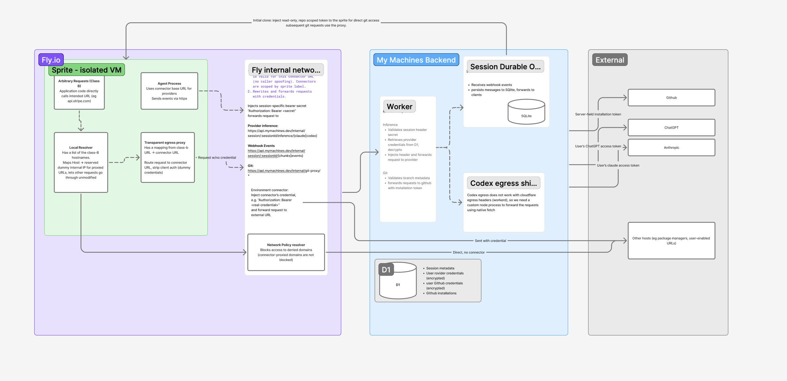

# Sprite Security & Authentication

How a session's Sprite VM is isolated, how its outbound traffic is classified,
and how each flow authenticates. **Roughly half of this architecture is
implemented today**; each section below is marked. The full plan and decision
history live in `openspec/changes/automate-sprites-custom-connectors/`.

## Trust model

- **In-VM root is untrusted.** The agent process runs arbitrary code, so
  anything readable on the Sprite — files, env vars, process memory — is
  extractable. Long-lived credentials therefore never rest on the VM.
- **Identity comes from the platform, not the VM.** Sprites carry
  `session:<sessionId>` labels that in-VM root cannot change. Fly's connector
  gateway verifies the calling Sprite's labels before injecting any credential,
  so possession of a URL is never authority by itself.
- **Credentials are injected at boundaries the Sprite can't cross.** The
  connector gateway injects session credentials after the identity check; the
  Worker injects upstream credentials (GitHub installation tokens, provider
  OAuth) after validating the session credential. The Sprite sees neither.

## Credential classes

Every outbound flow is classified and routed exactly one way
(see `design.md` in the openspec change for the full rationale):

| Class | Meaning | Examples | Path | Status |
|---|---|---|---|---|
| A | Credential → our control plane | webhooks, Git/inference capability mints, Claude/Codex inference | Sprite → per-session connector for identity-bound control calls; short-lived capabilities authorize direct Worker/Node data planes | Webhooks + Git mint **implemented**; inference **planned next** (S4) |
| B | Credential → external upstream | environment header secrets (e.g. an API key for `api.stripe.com`) | Sprite → transparent egress proxy → environment connector → upstream | **Planned** (S3/S5) |
| C | Direct egress allowed by environment | npm, pypi, user-allowlisted hosts | Direct, no connector credential, per `open`/`default`/`custom`/`locked` | **Implemented** |
| D | Direct egress denied by environment | hosts outside a restricted mode's rules | Denied by network policy (empty under `open`) | **Implemented** |

Class A never enters the transparent proxy. Webhooks and Git/inference capability
mints point at the connector gateway; Git data points directly at the Worker; and
provider CLIs point at a localhost sidecar that streams directly through the Cloude
Node provider proxy. The proxy exists only for class B, where arbitrary unmodified
tools address the real hostname and can't be reconfigured.

## Implemented today

- **Per-session connector (class A).** Maintained by an ordered runtime
  migration and targeted as a blocking setup task for new sessions; scoped to
  the Sprite's `session:<sessionId>` label; injects the DO's `webhook_token`;
  endpoint allowlist pins the two webhook routes, the ephemeral Git token mint
  route, and `/health`. Deleted (with reconciliation) at teardown. See
  `docs/sprite-connectors.md`.
- **Webhook events (class A).** The vm-agent sends chunks/events through the
  connector gateway; the gateway-injected token is validated by the session's
  Durable Object, which persists to SQLite and forwards to clients.
- **Git (class A mint + direct data plane).** The initial clone injects a
  short-lived, read-only, repo-scoped installation token that never persists.
  Afterwards, a repo-local credential helper mints five-minute ephemeral Git
  tokens through the connector gateway and Git presents them (HTTP Basic)
  directly to the Worker Git proxy, which validates the token, repository, and
  branch policy in the DO, then forwards to GitHub with an installation token.
  Git data stays direct-to-Worker because the gateway does not support Git's
  smart-HTTP media types. See
  `docs/github-app-auth.md` and `docs/sprite-connectors.md`.
- **Network policy (classes C/D).** L3/L4 allow/deny built per environment
  network mode; the Worker hostname and connector gateway hostname are always
  reachable; denied hosts are blocked at the policy layer, not the proxy.
- **Teardown revocation.** Session deletion revokes ephemeral Git tokens and
  the webhook token before slow external cleanup, then deletes the connector.
- **Encrypted credential storage.** D1 holds session metadata, GitHub
  installations, and encrypted GitHub user credentials; session secrets
  (webhook token, ephemeral Git tokens) live in the DO's SQLite.

## Planned

- **Provider inference through the control plane (S4, before class B).** A live
  managed OpenRouter probe confirmed the Sprites gateway buffers SSE. Claude/Codex
  therefore use localhost custom bases. A sidecar mints a five-minute
  session/provider-scoped inference capability through the connector, then calls one
  shared Node provider proxy directly. Node validates through the Worker/DO, receives
  only current provider access material, and streams to Anthropic or ChatGPT. The
  Worker remains the sole D1/OAuth-refresh owner; Node gets no refresh token. Until
  this lands, provider credentials follow their current delivery path.
- **Environment header credentials (class B, S3/S5).** A Sprite-local resolver
  maps protected hostnames to a reserved IP; a transparent MITM egress proxy
  (per-Sprite CA, per-host leaf certs) strips whatever placeholder credential
  the tool sent and routes to a per-hostname environment connector, which
  injects the real Sprites-custodied secret and forwards to the upstream.
  Environment connectors (`env:<environmentId>` label scope) and their D1
  metadata are part of this phase.
## Known limits (accepted, documented)

- An extracted, still-valid ephemeral Git token is replayable off-Sprite for at
  most its five-minute TTL. Connector identity prevents off-Sprite mint/refresh,
  not replay inside the TTL; teardown revokes immediately.
- The planned inference capability has the same five-minute replay boundary, but is
  additionally scoped to one session and provider and contains no provider
  credential. Teardown revokes it immediately.
- An older session retains its legacy Sprite-held webhook-token fallback until
  its connector runtime migration succeeds.

## Related docs

- `docs/sprite-connectors.md` — connector mint/verify/delete mechanics and the
  gateway `Accept` limitation.
- `docs/github-app-auth.md` — GitHub App tokens, clone auth, and the Git proxy.
- `openspec/changes/automate-sprites-custom-connectors/design.md` — full design,
  threat prongs, and sequence diagrams.
