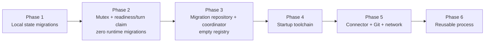
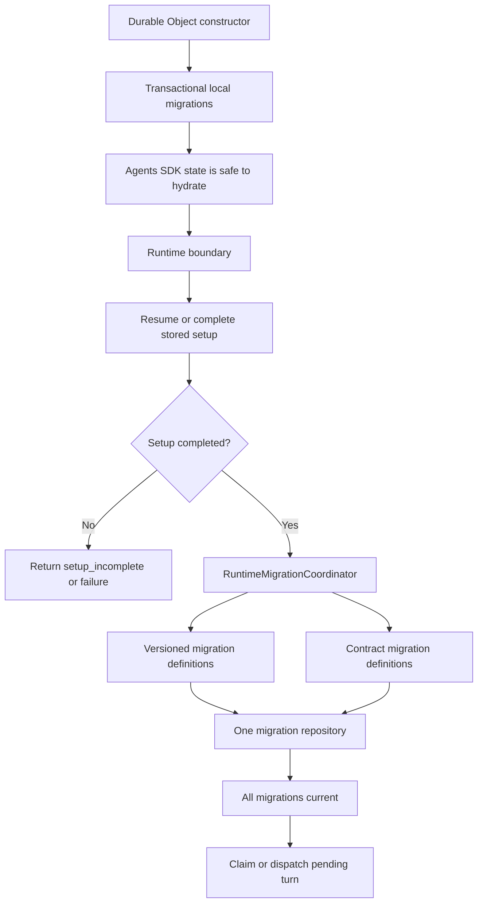
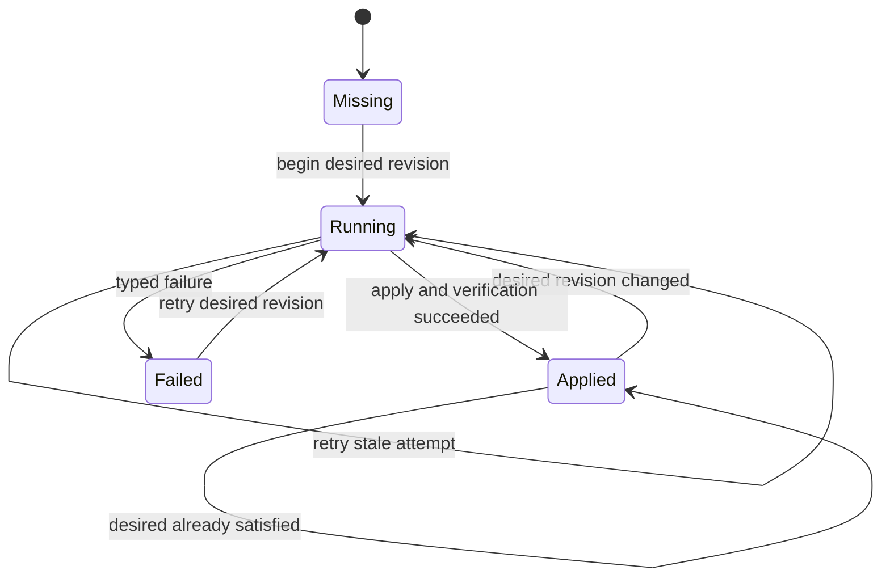
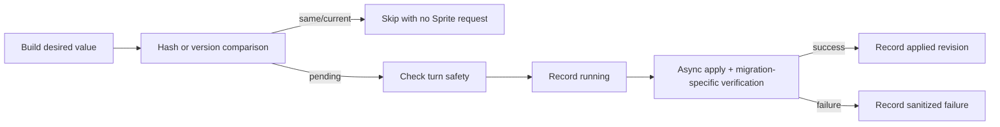
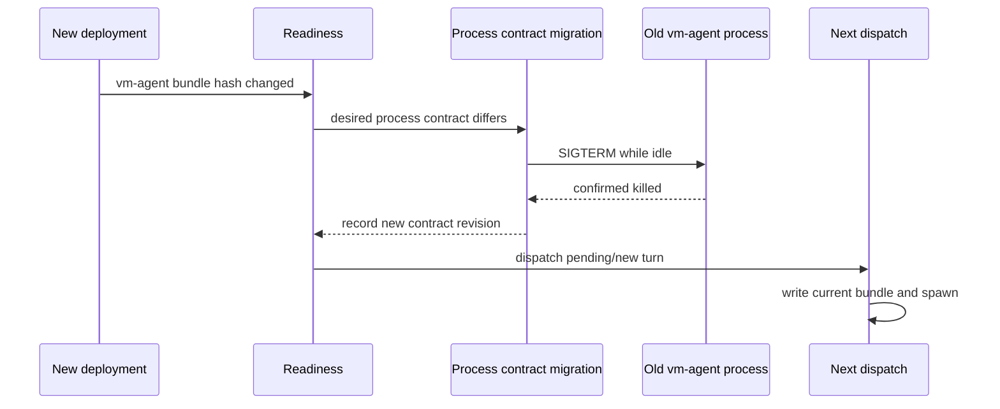
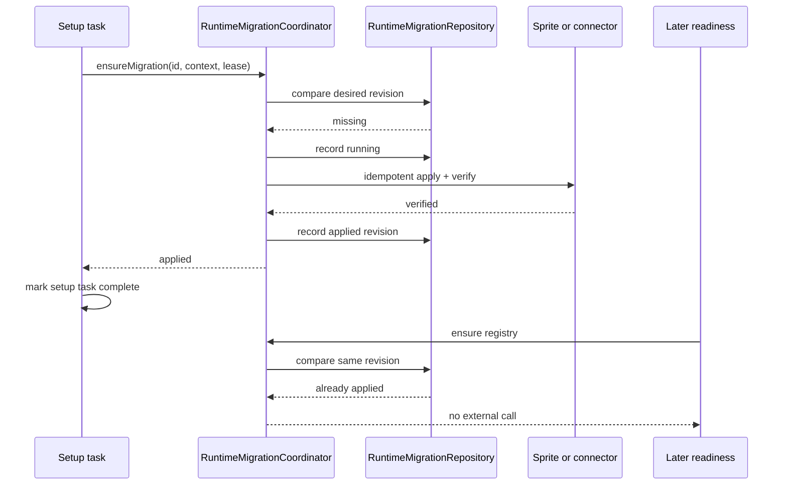
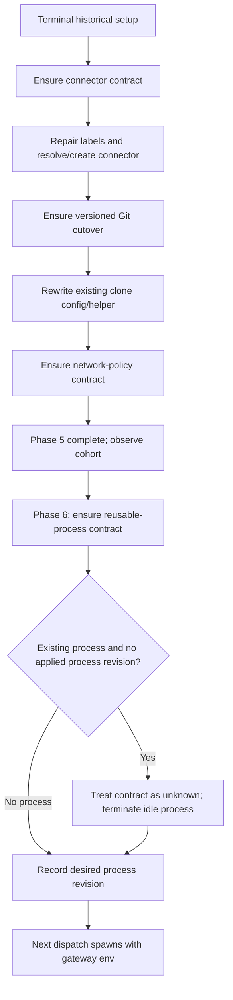

## Context

A session persists several kinds of state with different ownership and failure
boundaries:

- Durable Object-owned SQLite tables and JSON values.
- Agents SDK-owned client state in `cf_agents_state`.
- A stored, client-visible setup run.
- External Sprite filesystem, process, service, and network state.
- External Sprites connector state plus D1 connector metadata.
- A currently separate startup-toolchain checkpoint in ServerState.
- D1 schema/data managed through deployment migrations.

Local SQLite changes can be committed atomically with their migration record.
Sprite and connector effects cannot. A Worker can stop after an external effect
but before the Durable Object records it. External work must therefore be
idempotent, verified, and safe to retry at least once.

Setup is intentionally terminal and client-visible. Reopening or splicing an old
setup run would rewrite history and make every past task order part of the
permanent runtime contract. New requirements need a post-setup path.

The current startup-toolchain code already builds a deterministic contract and
hashes it. The mechanism is sound; its lifecycle is not. It is called from a
terminal setup task, guarded away when a checkpoint exists, and absent from
normal readiness. It therefore never reconciles an existing session after a
deployment changes a contract input.

The runtime migration system must also accommodate changes whose future shape is
unknown. Examples include:

- replace the current Git credential-helper flow with a direct connector URL;
- install a local Sprite service and later change or remove it;
- change connector endpoints or rotate its stored credential;
- change the vm-agent bundle or process environment;
- perform a one-time filesystem or base-image transition;

The design uses one runtime engine with two revision strategies rather than two
parallel orchestration systems.

## Goals / Non-Goals

**Goals:**

- Migrate Durable Object-local state transactionally before normal reads.
- Migrate the Agents SDK state row before SDK hydration or broadcast.
- Preserve stored setup task arrays as immutable historical snapshots.
- Declare runtime migrations statically and resolve desired values at runtime.
- Support arbitrary forward-only versioned transitions.
- Support recurring hash-based desired-state reconciliation.
- Use one runtime migration repository, coordinator, mutex, retry model, and observability path for
both runtime migration forms.
- Fold startup-toolchain reconciliation into that coordinator.
- Detect changes to every deployment-owned reusable vm-agent process input that
is frozen at spawn, including bundle contents and relevant environment values,
excluding rotating credential material delivered outside the contract.
- Keep raw secrets out of the migration table and logs.
- Prevent Sprite/process mutation from racing with `beginTurn()`.
- Make new-session setup and legacy-session reconciliation use the same
migration definitions.
- Keep the API open to future migrations without requiring a dependency graph,
exhaustive category enum, or schema redesign.

**Non-Goals:**

- Replacing D1's deployment migration system.
- Treating Sprite creation as a runtime migration. Sprite creation is a
prerequisite tied to session identity; a future Sprite replacement can be a
runtime migration.
- Detecting arbitrary out-of-band drift on every turn. Contract revision
equality is an optimization based on the last verified apply.
- Automatically updating a session when its source environment record changes.
The persisted session environment snapshot remains authoritative for this
change.
- Running external work inside a SQLite transaction.
- Running process-affecting work during an active turn.
- Delivering refreshed provider credentials to an already-running reused
process. Reused dispatches currently run on spawn-time credentials; per-turn
credential delivery is an explicit follow-up change.
- Pinging URLs to verify connector or network state.
- Supporting downward local-data migrations.
- Adding a general migration dependency graph or parallel executor.
- Supporting per-migration background or concurrent-safe execution policies.
Every initial runtime migration is awaited before turn dispatch.
- Treating every recurring maintenance job as a migration. A runtime migration
must still have a durable desired revision.


## Deployment Plan: Activate One Risk Boundary at a Time

The detailed pseudocode below describes the final state after all phases. The
implementation must not ship that final state as one deployment. Each phase is
its own merge/deploy/observation unit and may begin only after the preceding
phase's exit gate passes.



| Phase | Newly active behavior | Registry after deployment | Must remain inactive | Exit gate |
| --- | --- | --- | --- | --- |
| 1. Local foundation | Pre-hydration `migrateAll()` ordering and the migration-only Agents SDK row adapter, with zero registered steps | nonexistent | mutex, runtime migration repository, external reconciliation, any data migration | historical fixtures, atomic rollback, and pre-hydration ordering pass against fixture migrations |
| 2. Runtime boundary | FIFO mutex, branded lease, `_ensureReady(lease)`, readiness-to-turn claim serialization, pending-claim split | nonexistent | all runtime migration types, tables, definitions, and external migration effects | concurrency/crash tests pass and production shows no dispatch regression |
| 3. Inert engine | revision API, canonical hashing, `RuntimeMigrationRepository`, coordinator, logs/metrics, readiness call into engine | exactly `[]` | every adopter and every setup `ensureMigration` call | empty-registry tests prove zero migration records and zero Sprite/connector/process calls |
| 4. Toolchain adopter | immutable setup integration, targeted ensure, legacy checkpoint adoption, startup-toolchain contract | `[sprite.startup-toolchain]` | connector, Git, network, process definitions | new and legacy canaries adopt/reconcile without setup-history mutation |
| 5. Session networking adopters | connector resource, Git cutover, network-policy reconciliation | toolchain, connector, Git, network | reusable-process definition and destructive legacy cleanup | connector/Git/network canaries and legacy end-to-end cohort pass |
| 6. Reusable-process adopter | process launch contract and fail-closed idle termination on desired revision change | toolchain, connector, Git, network, process | later cleanup migrations | process restart/reuse metrics and rollback exercise pass |

### Phase 1: local migration foundation

Phase 1 changes only local, constructor-time persistence behavior:

- add historical fixture support;
- run `migrateAll()` before ServerState load, service construction, and SDK
  state hydration, so any future local migration lands pre-hydration;
- add the migration-only `cf_agents_state` adapter as the registration seam;
- derive local state shapes from schemas so a future step has a validator;
- emit no client broadcast from migration code.

Phase 1 deliberately ships **no data migration**. Every live session already
stores ServerState and client state at the current shape, so there is nothing
to backfill. Shipping a whole-shape normalization step would only persist what
each read already computes, and would freeze live defaults into append-only
history where their meaning drifts. The deliverable is the ordering guarantee
and the seam; steps are appended surgically when a field actually changes.

A surgical step reads the row, transforms only the fields that changed,
validates the result against that state's current schema, and writes it back.
A throw rolls the transaction back and leaves the version unrecorded, so the
step retries on the next cold start rather than committing a row current code
cannot read. Because no production step exists yet, transform, rollback,
no-op, and skip behavior are proven by fixture migrations driven through the
real `migrateAll` runner — the same "prove the engine, register nothing"
approach Phase 3 uses for the runtime registry.

Read paths deliberately do not validate. `ServerStateRepository.get()` merges
onto defaults without parsing: a parse failure during construction would leave
the session unreachable with no recovery path, since the Durable Object is the
only way to reach its own state. Validation that can reject a row belongs in a
migration, where failure is recoverable.

All local changes in this phase are additive or dual-read compatible with the
previous deployment. A rollback may ignore newly added tables/fields, but must
not encounter a representation the old code cannot parse. Destructive field
removal remains a later deployment after the rollback window.

### Phase 2: ship the race fix with zero runtime migrations

Phase 2 is independently valuable and must not depend on the runtime migration
engine. It introduces:

- `RuntimeBoundaryMutex` and `RuntimeBoundaryLease`;
- one `ensureRuntimeReadyAndDispatchNextTurn()` orchestrator plus private readiness-only
  `_ensureReady(lease)`;
- final readiness, conflict check, and synchronous `beginTurn()` under one
  mutex ownership interval;
- the split between synchronous pending-turn claim and asynchronous dispatch;
- webhook exclusion from the application mutex;
- recovery/tests for every durable claim-to-dispatch crash boundary.

The Phase 2 `_ensureReady(lease)` performs only the behavior that exists before
runtime migrations: initialization, provisioning/setup, and the final pending
claim decision. It has no runtime registry parameter, creates no
`session_runtime_migrations` table or rows, and cannot call a migration
coordinator. Any final-state pseudocode that accepts prepared process inputs or
invokes `ensureMigrations` is added only in later phases.

Phase 2 exit assertions are load-bearing:

```ts
expect(runtimeMigrationRegistry).not.toBeDefined();
expect(runtimeMigrationRepository).not.toBeDefined();
expect(spriteMutationDuringReadinessRaceWindow).toHaveCount(0);
```

Rollback of Phase 2 changes only application orchestration; it must not require
data rollback because Phase 2 introduces no runtime migration persistence.

### Phase 3: deploy the engine dark with an empty registry

Phase 3 adds the generic runtime machinery, then connects it to readiness with
an explicitly empty static registry:

```ts
export const RUNTIME_MIGRATIONS = [] as const;
```

An empty registry returns `current` without writing a migration record or contacting
the Sprite, connector API, process manager, or setup executor. This phase proves
constructor wiring, lease plumbing, `RuntimeMigrationRepository` schema, comparison semantics,
failure handling, and secret-safe observability without activating external
work. Setup still has no targeted `ensureMigration` call.

Old code ignores the additive `session_runtime_migrations` table on rollback. Do not register a
placeholder/tombstone migration merely to test the engine; unit and integration
fixtures exercise non-empty definitions without production registration.

### Phase 4: use startup toolchain as the first production adopter

Phase 4 appends exactly one definition:

```ts
export const RUNTIME_MIGRATIONS = [startupToolchainMigration] as const;
```

This phase also makes setup task arrays immutable and introduces targeted
`ensureMigration(id, context, lease)` at the cloud-container point. The legacy
`ServerState.startupToolchain` checkpoint remains readable during the
observation window so matching sessions can adopt the migration revision without
a Sprite call. Do not remove the legacy checkpoint in the same deployment that
first activates the adopter.

The first adopter is intentionally Sprite-local and idempotent. It exercises
both fresh setup and completed-session readiness without connector replacement,
Git cutover, network-policy changes, or process termination.

### Phase 5: append connector, Git, and network as one ordered cohort

Phase 5 extends the proven registry without reordering prior definitions:

```ts
export const RUNTIME_MIGRATIONS = [
  startupToolchainMigration,
  sessionConnectorResourceMigration,
  gitEphemeralTokenCutoverMigration,
  networkPolicyMigration,
] as const;
```

These definitions form one rollout cohort because Git and final network policy
consume the connector outcome. Targeted setup calls are added at their complete
postcondition points. Legacy destructive cleanup remains disabled so rollback
can continue using the old Git/webhook material. A failed cohort stops before
turn admission and retries through the runtime migration repository.

### Phase 6: append reusable-process reconciliation last

Only after Phase 5 is stable does the registry append
`agent.reusable-process`. This phase introduces prepared launch inputs and may
terminate an idle persistent process when the desired process contract revision
changes. Readiness terminates only; the ordinary dispatch path creates the
replacement and preserves `agentSessionId`.

Canaries must cover idle reusable processes, no-process sessions, active-turn
deferral, termination failure, already-gone processes, and rollback to the
previous process contract. Cleanup migrations remain a later deployment after
the rollback window.

### Cross-phase rules

- Never activate the first definition from phase N and phase N+1 in the same
  production deployment.
- Phases are authored as a stack of pull requests, each targeting the branch
  below it. Stacking is a review tool, not a merge-batching one: merging is
  deploying, because the api-server deploy workflow triggers on push to `main`.
  Merge the bottom PR only, one phase at a time, with its observation window in
  between. Do not use a stack-wide merge command, which lands every PR below the
  target in one push and collapses several phase boundaries into one deployment.
- Keep the stack shallow, around three layers. Phases 4 through 6 reconcile
  external connector, Git, and process state, and their design depends on what
  phases 2 and 3 show in production; authoring them earlier writes against
  unvalidated assumptions and forces repeated rebases of the whole chain.
- Registry snapshots are asserted exactly for phases 3 through 6; accidental
  early registration fails tests.
- Every phase runs build, lint, typecheck, focused tests, strict OpenSpec
  validation, and an observation window before advancing.
- Roll forward with a compensating migration after externally visible versioned
  work; do not rewrite an applied migration's historical meaning.
- A rollback may leave additive tables and migration records in place. Older code
  must ignore them safely.
- Destructive cleanup is never part of the adopter's first activation.


## System Model




There are still separate **local** and **runtime** migration planes because they
have different atomicity. Within the runtime plane there is one engine, not one
engine for hashes and another for numbered migrations.

## Decisions


### 1. Keep transactional local migrations separate from runtime migrations


| Plane                      | Trigger                     | Atomicity                                        | Revision source                    | Examples                                              |
| -------------------------- | --------------------------- | ------------------------------------------------ | ---------------------------------- | ----------------------------------------------------- |
| Local repository migration | Durable Object construction | SQLite transaction includes effect and record    | append-only repository array index | table change, JSON rename, SDK client-state transform |
| Runtime migration          | readiness/runtime boundary  | at-least-once external effect plus local migration record | explicit version or contract hash  | connector, toolchain, process restart, Git cutover    |
| D1 migration               | deployment workflow         | D1-defined                                       | D1 migration file                  | D1 schema/data                                        |


A single generic transaction abstraction would be false: a connector PATCH or
Sprite command cannot commit atomically with a SQLite row. Both local and runtime
migrations are forward-oriented, but they deliberately expose different failure
semantics.

#### Constructor ordering

The intended constructor sequence is:

1. call `super(ctx, env)` so the Agents SDK can establish its storage;
2. construct only the repository objects needed for migration;
3. call `migrateAll(...)`, including the migration-only SDK-state adapter;
4. load ServerState;
5. construct services that can access ServerState or client state;
6. allow socket snapshots and normal SDK state hydration.

```ts
constructor(ctx: DurableObjectState, env: Env) {
  super(ctx, env);

  const sql = this.sql.bind(this);
  const repositories = createMigrationRepositories(sql);

  migrateAll(sql, ctx.storage, repositories.all);

  this.serverState = repositories.serverState.get();
  this.constructRuntimeServices(repositories);
}
```

The SDK adapter directly accesses `cf_agents_state` and `cf_state_row_id` only
at this pre-hydration boundary. Any step it registers parses historical state as
`unknown`, transforms only the fields that changed, validates the final value
with `ClientStateSchema`, and updates the row within the local migration
transaction. Normal reads and writes continue through the Agents SDK.

The adapter ships with an empty migration array. It is registered in the
constructor so that appending a step is the only work a future client-state
migration requires; the pre-hydration ordering is already guaranteed and
tested.

### 2. Normalize runtime migrations around a typed revision

The engine does not know about "Git", "toolchains", "connectors", or
"capabilities." It knows only a stable migration ID, a revision strategy, and
an idempotent apply function.

```ts
type RuntimeMigrationRevision =
  | {
      kind: "version";
      version: number;
    }
  | {
      kind: "contract";
      hash: string;
    };

interface PreparedRuntimeMigration<Desired> {
  definition: RuntimeMigrationDefinition<Desired>;
  desired: Desired;
  revision: RuntimeMigrationRevision;
}

interface RuntimeMigrationDefinition<Desired> {
  id: string;
  description: string;

  prepare(
    context: RuntimeMigrationContext,
  ): Promise<Result<PreparedRuntimeMigration<Desired>, RuntimeMigrationError>>;

  apply(
    input: RuntimeMigrationApplyInput<Desired>,
  ): Promise<Result<void, RuntimeMigrationError>>;
}
```

`prepare()` is an internal normalized shape produced by declaration helpers.
Call sites should not manually construct it.

```ts
const migrations = [
  defineContractRuntimeMigration({
    id: "sprite.startup-toolchain",
    description: "Keep common and provider toolchain checks current",
    buildContract: buildStartupToolchainContract,
    apply: reconcileStartupToolchain,
  }),

  defineContractRuntimeMigration({
    id: "session.connector-resource",
    description: "Keep the session connector and policy current",
    buildContract: buildSessionConnectorContract,
    apply: reconcileSessionConnector,
  }),

  defineVersionedRuntimeMigration({
    id: "sprite.git-ephemeral-token-cutover",
    description: "Move an existing clone to the ephemeral token helper",
    version: 1,
    apply: applyEphemeralGitTokenCutover,
  }),

  defineContractRuntimeMigration({
    id: "sprite.network-policy",
    description: "Keep the Sprite network policy at its snapshotted value",
    buildContract: buildSpriteNetworkPolicyContract,
    apply: reconcileSpriteNetworkPolicy,
  }),

  defineContractRuntimeMigration({
    id: "agent.reusable-process",
    description: "Invalidate a process whose spawn-frozen inputs changed",
    buildContract: buildReusableAgentProcessContract,
    apply: reconcileReusableAgentProcess,
  }),
] as const satisfies readonly RuntimeMigrationDefinition<unknown>[];
```

The registry is a static ordered array in code. A contract definition is static;
its `buildContract(context)` value is constructed at runtime from the session,
deployment, and persisted snapshot.

#### Version declaration helper

```ts
function defineVersionedRuntimeMigration(args: {
  id: string;
  description: string;
  version: number;
  apply(
    input: RuntimeMigrationApplyInput<{ version: number }>,
  ): Promise<Result<void, RuntimeMigrationError>>;
}): RuntimeMigrationDefinition<{ version: number }> {
  assertPositiveSafeInteger(args.version);

  const definition: RuntimeMigrationDefinition<{ version: number }> = {
    ...args,
    prepare: async (context) => success({
      definition,
      desired: { version: args.version },
      revision: { kind: "version", version: args.version },
    }),
  };
  return definition;
}
```

A versioned migration is not a global schema number. The version is scoped to
one stable migration ID.

- Stored version lower than desired: apply current migration.
- Stored version equal to desired: skip.
- Stored version higher than desired after a code rollback: skip; never run an
older imperative transition over newer state.
- Missing record: apply.

If every intermediate transition must run, use separate migration IDs in
registry order. Bumping `version` means the current `apply` function can
converge from every earlier state directly to the current state.

#### Contract declaration helper

```ts
function defineContractRuntimeMigration<Contract extends JsonValue>(args: {
  id: string;
  description: string;
  buildContract(
    context: RuntimeMigrationContext,
  ): Contract | Promise<Contract>;
  apply(
    input: RuntimeMigrationApplyInput<Contract>,
  ): Promise<Result<void, RuntimeMigrationError>>;
}): RuntimeMigrationDefinition<Contract> {
  const definition: RuntimeMigrationDefinition<Contract> = {
    ...args,
    prepare: async (context) => {
      const contract = await args.buildContract(context);
      const hash = await hashRuntimeMigrationContract(args.id, contract);
      return success({
        definition,
        desired: contract,
        revision: { kind: "contract", hash },
      });
    },
  };
  return definition;
}
```

The contract object is the exact input the coordinator hashes. It is also passed
in-memory to `apply` so reconciliation cannot accidentally use different desired
values. The object is discarded after the attempt.

### 3. Persist attempted and applied revisions, not a "done" bit

`RuntimeMigrationRepository` stores one record per stable migration ID:

```sql
CREATE TABLE session_runtime_migrations (
  migration_id TEXT PRIMARY KEY NOT NULL,
  applied_revision TEXT,
  attempted_revision TEXT NOT NULL,

  status TEXT NOT NULL
    CHECK (status IN ('running', 'failed', 'applied')),
  attempt_count INTEGER NOT NULL DEFAULT 0,

  started_at TEXT,
  last_attempt_at TEXT NOT NULL,
  applied_at TEXT,

  last_error_code TEXT,
  last_error_message TEXT
);
```

Each revision column contains only the serialized discriminated union, for
example `{"kind":"version","version":2}` or
`{"kind":"contract","hash":"<sha256>"}`. It never contains the desired
contract preimage. `RuntimeMigrationRepository` is the only reader and treats
both columns as untrusted input:

```ts
const RuntimeMigrationRevisionSchema = z.discriminatedUnion("kind", [
  z.object({
    kind: z.literal("version"),
    version: z.number().int().positive().safe(),
  }),
  z.object({
    kind: z.literal("contract"),
    hash: z.string().regex(/^[a-f0-9]{64}$/),
  }),
]);

interface RuntimeMigrationRecord {
  migrationId: string;
  status: "running" | "failed" | "applied";
  appliedRevision: RuntimeMigrationRevision | null;
  attemptedRevision: RuntimeMigrationRevision;
  attemptCount: number;
  // Remaining timestamps and sanitized failure fields.
}

function parseRevision(raw: unknown): RuntimeMigrationRevision | null {
  if (raw === null) {
    return null;
  }
  if (typeof raw !== "string") {
    throw new RuntimeMigrationRowError("revision is not text");
  }
  return RuntimeMigrationRevisionSchema.parse(JSON.parse(raw));
}

function parseRequiredRevision(raw: unknown): RuntimeMigrationRevision {
  const revision = parseRevision(raw);
  if (revision === null) {
    throw new RuntimeMigrationRowError("attempted revision is null");
  }
  return revision;
}
```

One shared serializer writes a stable JSON representation. `markApplied`
compares the stored `attempted_revision` with that serialized expected revision
in its conditional update, preventing a stale completion from winning. The
repository rejects malformed JSON, an invalid union member, different applied
and attempted kinds, or a kind that conflicts with the static definition for
that migration ID.

The invariants are load-bearing:

- the migration kind for an ID never changes;
- the attempted revision is retained across failure/interruption;
- the prior applied revision is retained while a newer attempt is running;
- only verified success advances the applied revision;
- raw desired contract JSON is never persisted.

The repository remains a CRUD persistence boundary. It does not own retry
policy, status interpretation, or a repository-wide diagnostic list. The
coordinator exhaustively interprets `applied`, `running`, and `failed` records
and owns bounded retry/backoff. An operator-visible pending/failed query should
be added with its actual transport rather than preserved as an unused list API.




#### Revision comparison

```ts
type RevisionDisposition =
  | { kind: "apply" }
  | { kind: "current" }
  | { kind: "newer_version"; appliedVersion: number };

function compareRevision(
  record: RuntimeMigrationRecord | null,
  desired: RuntimeMigrationRevision,
): Result<RevisionDisposition, RuntimeMigrationError> {
  if (record === null || record.appliedRevision === null) {
    return success({ kind: "apply" });
  }
  const applied = record.appliedRevision;

  switch (applied.kind) {
    case "version":
      if (desired.kind !== "version") {
        return failure(revisionKindChanged(record.migrationId));
      }
      if (applied.version > desired.version) {
        return success({
          kind: "newer_version",
          appliedVersion: applied.version,
        });
      }
      return success(
        applied.version < desired.version || record.status !== "applied"
          ? { kind: "apply" }
          : { kind: "current" },
      );
    case "contract":
      if (desired.kind !== "contract") {
        return failure(revisionKindChanged(record.migrationId));
      }
      return success(
        applied.hash !== desired.hash || record.status !== "applied"
          ? { kind: "apply" }
          : { kind: "current" },
      );
  }
}
```

A higher stored version is expected during a rolling deployment or code
rollback, so it is not an invariant failure. The coordinator skips the older
imperative transition and emits `newer_version_skipped` as a warning-level
lifecycle event containing both desired and applied versions because
compatibility with newer external state is still an operationally important
condition.

A stale `running` record is retry evidence, not a distributed lock. A Worker may
stop at any point:

```text
record running
    ↓
external effect 1
    ↓
external effect 2
    ↓
verify
    ↓
record applied
```

The next activation must safely repeat after zero, one, or all external effects.

If deployment changes the desired contract during an old attempt, either:

- the old activation finishes and records the old hash; the next activation
sees the new hash and reconciles again; or
- the old activation stops and the new activation retries directly against the
new desired contract.

Neither case marks the new revision without applying it.

The repository's applied revision is the reconciliation checkpoint. The initial
system deliberately trusts it: when the applied revision satisfies the desired
revision, readiness does not compare a second process/connector/toolchain hash,
does not call the external system, and does not expose a generic invalidation
API. A contract migration runs again when its desired contract hash changes; a
versioned migration runs again when its desired version increases.

This means the initial system detects deployment-input changes, not arbitrary
out-of-band drift after a revision was verified. If a concrete integration
later needs repair-on-observed-drift, add a narrowly specified repair trigger
with a real producer and recovery contract rather than prebuilding a generic
invalidation state. That future addition can reuse
`RuntimeMigrationRepository` without changing the revision model.

### 4. Canonicalize contracts and fingerprint secrets safely

Contract hashing uses SHA-256 with a domain-separated preimage:

```ts
async function hashRuntimeMigrationContract(
  migrationId: string,
  contract: JsonValue,
): Promise<string> {
  const canonical = canonicalJson(contract);
  return sha256(
    `runtime-migration-contract:v1\n${migrationId}\n${canonical}`,
  );
}
```

Canonical JSON:

- recursively sorts object keys;
- preserves array order;
- represents strings, booleans, finite numbers, and null exactly;
- rejects `undefined`, functions, symbols, `Date`, `Map`, `Set`, `BigInt`,
`NaN`, and infinities;
- does not depend on object insertion order;
- has a contract-test fixture shared by all migrations.

Secret values are reduced before entering the contract object:

```ts
interface SecretFingerprint {
  algorithm: "sha256";
  digest: string;
}

async function fingerprintSecret(secret: string): Promise<SecretFingerprint> {
  return {
    algorithm: "sha256",
    digest: await sha256(secret),
  };
}
```

The persisted revision is therefore conceptually:

```text
sha256(
  canonicalJson({
    nonSecretDesiredValues,
    credential: {
      algorithm: "sha256",
      digest: sha256(secret)
    }
  })
)
```

This detects rotation without storing the secret. Hashing is not encryption. A
low-entropy secret would require a keyed fingerprint or a durable secret version
rather than plain SHA-256. No initial contract fingerprints a secret: the
process contract excludes provider credentials and webhook credentials entirely.
The mechanism is retained for future contract inputs that must reflect rotation,
such as a later connector-credential fingerprint.

Security invariants:

- never log or persist the contract preimage;
- never include raw secrets in structured logging fields or failure messages;
- log only migration ID, revision kind, revision hash/version, attempt, event,
and duration;
- sanitize integration errors before migration-record persistence;
- do not persist stdout/stderr unless separately redacted and bounded;
- contract builders must not accidentally return credential objects whose
`toString` or serializer can leak additional data.


### 5. `apply` includes verification; there is no generic `verify` callback

The coordinator cannot define one useful verification API for arbitrary
external effects. Verification may be a connector readback, an exit-code and
version check, a file-content hash, a service-status check, or simply proving
that no old process exists.

Therefore:

```ts
apply(...): Promise<Result<void, RuntimeMigrationError>>
```

means:

> Apply idempotently and return success only after the migration-specific
> postcondition has been verified.

The coordinator records `applied` only after `apply` returns success. A migration
that performs an effect but cannot verify it returns failure and is retried.

This keeps a sync hash comparison separate from async external verification:




### 6. Choose version or contract per migration, not per subsystem


| Question                                                | Prefer versioned     | Prefer contract                   |
| ------------------------------------------------------- | -------------------- | --------------------------------- |
| Is this a historical transition?                        | yes                  | no                                |
| Should deployment input changes automatically rerun it? | no                   | yes                               |
| Is there a natural desired value that can be built now? | not required         | required                          |
| Must intermediate revisions run?                        | separate ordered IDs | usually no                        |
| Is arbitrary future evolution expected?                 | often                | still allowed                     |
| Is out-of-band drift checked every turn?                | no                   | no; last verified hash is trusted |


Examples:

- Codex/Claude minimum version and repair script: contract.
- Connector access policy: contract.
- Network policy derived from the persisted session snapshot: contract.
- vm-agent reusable process launch specification: contract.
- Adopt the current ephemeral Git helper: versioned.
- Later remove the helper and use a direct connector URL: a new versioned
migration.
- One-time filesystem layout conversion: versioned.
- Install and continually upgrade a local service: contract.
- Migrate that service's persistent data format before an upgrade: versioned.

This is the extensibility seam. Adding a new migration does not require adding a
new coordinator category or changing the `RuntimeMigrationRepository` schema.

#### Future direct connector URL

```ts
defineVersionedRuntimeMigration({
  id: "sprite.git-direct-connector-url",
  description: "Replace the helper flow with a direct connector remote",
  version: 1,
  apply: async ({ context }) => {
    // Observe current Git configuration.
    // Set the direct connector URL.
    // Remove helper-specific credential configuration.
    // Verify the resulting remote/configuration without network pinging.
    return success(undefined);
  },
});
```

The earlier `sprite.git-ephemeral-token-cutover` remains applied and is skipped.
It does not fight the newer migration because it is versioned, not a recurring
contract. If direct Git configuration later becomes deployment-controlled, add
a new contract migration at that point.

#### Evolving or retiring a contract

A contract migration can change shape because the hash treats the desired value
as opaque JSON. It does not require a global discriminated union.

However, an old recurring contract must not continue enforcing state that a new
migration removes. Use one of these rollout patterns:

1. change the old contract to a terminal `retired` desired value whose apply
  stops enforcing legacy state, then run the new migration;
2. keep the old contract stable but make the new migration's apply fully
  supersede it, and remove/retire the old definition in the same compatible
   rollout;
3. for late-waking sessions, keep a small retired/tombstone definition until a
  separately versioned cleanup can handle every predecessor state.

Never silently reuse an ID for an unrelated meaning or switch its revision kind.

### 7. Keep order explicit and await every migration

Runtime migrations run serially in registry order. No graph is built, no
parallel execution is attempted, and no definition declares a separate
execution policy.

```ts
type RuntimeMigrationCoordinatorOutcome =
  | { outcome: "current" }
  | { outcome: "applied" }
  | { outcome: "deferred_active_turn" };

type RuntimeMigrationCoordinatorResult = Result<
  RuntimeMigrationCoordinatorOutcome,
  RuntimeMigrationError
>;

type RuntimeMigrationEntryResult = Result<
  { outcome: "current" } | { outcome: "applied" },
  RuntimeMigrationError
>;

async function ensureDefinitions(
  definitions: readonly RuntimeMigrationDefinition[],
  context: RuntimeMigrationContext,
  lease: RuntimeBoundaryLease,
): Promise<RuntimeMigrationCoordinatorResult> {
  if (context.getServerState().activeUserMessageId !== null) {
    return success({ outcome: "deferred_active_turn" });
  }

  let appliedAny = false;

  for (const definition of definitions) {
    const result = await ensurePrepared(definition, context, lease);
    if (!result.ok) {
      return result;
    }

    if (result.value.outcome === "applied") {
      appliedAny = true;
    }
  }

  return success({ outcome: appliedAny ? "applied" : "current" });
}
```

Before preparing any definition, `ensureDefinitions` returns
`deferred_active_turn` when a turn is active. `ensurePrepared` has the narrower
`RuntimeMigrationEntryResult`: `current` when migration-record comparison skips
apply or `applied` after a fresh apply is verified and recorded. It cannot
return a range-level deferral. Failures use the `Result` error branch rather
than another success outcome. Both full and targeted execution use
`ensureDefinitions`, so they share the same range-level active-turn rule and
the same serial loop.

Rules:

- a failure stops later migrations and dispatch;
- if ordering is load-bearing, encode it in registry order and tests;
- preserve the relative order of existing definitions; a new
definition may be inserted at a reviewed point without renumbering IDs, but
existing IDs are not reordered casually;
- if several inseparable stages must always succeed together, keep them inside
one migration's idempotent `apply`;

Targeted setup calls preserve this same order. `ensureMigration(targetId)` means
"ensure the registry prefix through `targetId`," not "run this one ID in
isolation":

```ts
async function ensureMigration(
  targetId: string,
  context: RuntimeMigrationContext,
  lease: RuntimeBoundaryLease,
): Promise<RuntimeMigrationCoordinatorResult> {
  return ensureDefinitions(registryPrefixThrough(targetId), context, lease);
}

async function ensureMigrations(
  context: RuntimeMigrationContext,
  lease: RuntimeBoundaryLease,
): Promise<RuntimeMigrationCoordinatorResult> {
  return ensureDefinitions(registry, context, lease);
}
```

This gives setup prerequisite ordering without a graph. A target is invalid if
an earlier definition cannot be satisfied at that setup point.

The initial implementation does not execute independent migrations in parallel.
A graph or explicit execution policies can be proposed later without changing
the revision union or `RuntimeMigrationRepository` schema. Best-effort maintenance such as a
non-blocking repository refresh belongs to a separate future scheduler; if the
work becomes required for runtime correctness, declare it as an ordinary
awaited versioned or contract migration.

### 8. Use a runtime-boundary mutex, not `blockConcurrencyWhile`, for readiness

The current direct-chat path contains a race:

```text
await ensureReady()
await resolveAttachments()       <-- session still appears idle here
beginTurn()
```

Another readiness event can enter during attachment resolution and begin Sprite
mutation because `activeUserMessageId` is still null.

The required exclusion interval includes readiness and the synchronous turn
claim. A single in-memory FIFO `RuntimeBoundaryMutex` instance is shared by:

- readiness external mutation;
- targeted setup migration calls;
- the synchronous idle-to-active turn claim.

Chat does not create or acquire a second mutex instance. It enters this same
runtime boundary and extends ownership through `beginTurn()`.

`ctx.blockConcurrencyWhile` remains limited to durable initialization. Long
Sprite operations must not block all Durable Object events because inbound
webhooks need to complete an existing turn.

This is not the current webhook behavior being changed. Regular
`ensureRuntimeReadyAndDispatchNextTurn()` does not wrap webhook RPC handlers.
`blockConcurrencyWhile` is currently used by `handleInit`, so only that durable
initialization window globally gates other events. The proposed application
mutex is selective: webhook handlers never acquire it.

```ts
declare const runtimeBoundaryLeaseBrand: unique symbol;

type RuntimeBoundaryLease = {
  readonly [runtimeBoundaryLeaseBrand]: true;
};

class RuntimeBoundaryMutex {
  private tail: Promise<void> = Promise.resolve();

  async runExclusive<Value>(
    operation: (lease: RuntimeBoundaryLease) => Promise<Value>,
  ): Promise<Value> {
    const previous = this.tail;
    let release!: () => void;
    const current = new Promise<void>((resolve) => {
      release = resolve;
    });
    this.tail = previous.then(() => current);

    await previous;
    try {
      return await operation({} as RuntimeBoundaryLease);
    } finally {
      release();
    }
  }
}
```

Production code should use a tested mutex implementation with rejection-safe
tail handling, but retain this behavior.

#### Admission callers serialize and re-evaluate readiness

There is no separate `ensureReadyPromise`. Every
`ensureRuntimeReadyAndDispatchNextTurn()` call enters
the same admission method, which owns the mutex and calls private
`_ensureReady(lease)` after the preceding owner releases it. `_ensureReady` only
prepares the runtime; admission then claims at most one turn before releasing
the boundary, and dispatch performs process I/O afterward. The DO reads current
state after acquisition, so every caller re-evaluates rather than capturing
earlier state.

```ts
async admitNextTurn(preparedMessage?: PreparedChatMessage) {
  return this.runtimeBoundaryMutex.runExclusive(async (lease) => {
    this.chatDispatchService.recoverInterruptedClaim();
    const readiness = await this._ensureReady(lease);
    if (!readiness.ok || readiness.value.outcome !== "ready") {
      return { readiness, admission: null };
    }

    // Pending initial work always takes priority over a prepared direct message.
    const pendingTurn = this.chatDispatchService.claimPendingMessage();
    if (pendingTurn) {
      return { readiness, admission: { source: "pending", turn: pendingTurn } };
    }
    if (preparedMessage && !this.serverState.activeUserMessageId) {
      const turn = this.chatDispatchService.claimPreparedMessage(preparedMessage);
      return { readiness, admission: { source: "prepared", turn } };
    }
    return { readiness, admission: null };
  });
}

async ensureRuntimeReadyAndDispatchNextTurn(
  preparedMessage?: PreparedChatMessage,
) {
  return this.keepAliveWhile(async () => {
    const result = await this.admitNextTurn(preparedMessage);
    // Process I/O happens after activeUserMessageId is durable and after the
    // selective runtime boundary is released.
    if (result.admission) {
      await this.chatDispatchService.spawnClaimedTurn(result.admission.turn);
    }
    return mapDispatchResult(result, preparedMessage);
  });
}
```

For concurrent calls A and B, B does not duplicate A's external work while A is
running. B waits, then recomputes desired revisions and normally skips every
migration from local migration-record equality:

```text
A: acquire ── initialize/setup/migrate ── claim pending? ── release ── spawn?
B:          wait ───────────────────────────────────────── acquire ── cheap recheck ── release
```

This favors one correctness primitive over a second single-flight cache. If
profiling later shows the cheap serialized recheck is material, coalescing can
be added as an optimization without changing mutex ownership or
`RuntimeMigrationRepository` semantics.

#### Direct chat uses the same dispatch entry point

Slow, non-mutating preparation may happen first. The final readiness pass,
conflict check, state persistence, and `beginTurn()` happen under the runtime
boundary with no `await` between "ready" and the active-turn write.

```ts
async function handleUserChatMessage(
  connection: Connection,
  payload: ChatMessageEvent,
): Promise<void> {
  // This may read attachments and prepare credentials, but it must not persist
  // the message, mutate client/server state, or begin the turn.
  const preparedMessage = await chatDispatchService.prepareMessage(payload);

  // The same orchestrator used by init/connect gives pending initial work
  // priority, otherwise synchronously claims this prepared message.
  const admission = await this.ensureRuntimeReadyAndDispatchNextTurn(
    preparedMessage,
  );

  if (!admission.ok) {
    sendChatFailure(connection, admission.error);
    return;
  }
}
```

If spawn fails, the existing turn-failure path clears active state. A later
readiness event can retry pending migration work.

Direct chat prepares its non-mutating input first, then passes it to the same
`ensureRuntimeReadyAndDispatchNextTurn()` orchestrator used by init and
connection events. Its
admission stage owns the one mutex acquisition, calls readiness-only
`_ensureReady(lease)`, gives a pending initial message priority, and otherwise
claims the prepared direct message without another await. The dispatch stage
then performs process I/O outside the boundary. This avoids both a second
orchestration path and the post-readiness admission gap without making readiness
itself responsible for accepting or spawning work.

#### Why inbound webhooks stay outside

The mutex is an application-level gate used by readiness and turn creation. It
does not block webhook handlers. During an active turn:

- readiness sees `activeUserMessageId` and defers pending migration work;
- webhook chunks continue;
- terminal webhook handling clears `activeUserMessageId`;
- turn completion queues another readiness pass.

This prevents the deadlock where readiness waits for idle while webhook handling
is unable to make the session idle.

#### Mutex ownership is orchestration-level and non-reentrant

The coordinator does not acquire `RuntimeBoundaryMutex` internally. The Durable
Object owns the mutex and private `_ensureReady(lease)` implementation. It
delegates cohesive provisioning and turn operations to their existing services
rather than introducing a second orchestration object.
`ensureRuntimeReadyAndDispatchNextTurn()`, with an optional prepared direct
message, is the one normal orchestration entry;
its `admitNextTurn()` stage acquires the mutex. The mutex yields an opaque
branded lease, and every internal method that assumes ownership requires that
lease:

```ts
await this.runtimeBoundaryMutex.runExclusive(async (lease) => {
  await this._ensureReady(lease);
});
```

This matters because setup runs inside the readiness boundary and calls targeted
`ensureMigration`. If that method attempted to acquire the same non-reentrant
mutex again, it would deadlock. `_ensureReady(lease, ...)`,
`ensureMigrations(context, lease)`, and targeted
`ensureMigration(id, context, lease)` therefore require the current
`RuntimeBoundaryLease`; omitting the boundary becomes a compile error. The
lease is module-private and is not exposed through a Durable Object/RPC entry
point.

The lease is a compile-time ownership guard, not a temporal type: TypeScript
cannot prevent code from retaining a token after the callback returns. Keep focused runtime
tests for FIFO release and non-reentrant call paths, but do not use tests as the
sole enforcement of the ordinary ownership precondition.

### 9. Define the readiness pipeline and outcomes precisely

```ts
type EnsureReadyOutcome =
  | { outcome: "ready" }
  | { outcome: "setup_incomplete" }
  | { outcome: "deferred_active_turn" };

type EnsureReadyResult = Result<
  EnsureReadyOutcome,
  RuntimeReadinessError
>;
```

There is no ambiguous `progress` return. Migration attempt/status information
lives in migration records and observability events.

```ts
private async _ensureReady(
  lease: RuntimeBoundaryLease,
  preparedProcessInputs?: PreparedReusableAgentProcess,
): Promise<EnsureReadyResult> {
  const initialized = await waitForInitialization();
  if (!initialized.ok) {
    return initialized;
  }

  const provisioned = await provisionService.ensureProvisioned({
    runtimeBoundaryLease: lease,
  });
  if (!provisioned.ok) {
    return provisioned;
  }

  if (!isSetupTerminalSuccess(clientState.sessionSetupRun)) {
    return success({ outcome: "setup_incomplete" });
  }

  const migrations = await runtimeMigrationCoordinator.ensureMigrations(
    buildRuntimeMigrationContext({ preparedProcessInputs }),
    lease,
  );
  if (!migrations.ok) {
    return mapMigrationOutcome(migrations);
  }
  if (migrations.value.outcome === "deferred_active_turn") {
    return mapMigrationOutcome(migrations);
  }

  return success({ outcome: "ready" });
}
```

`_ensureReady(lease)` is the readiness-only prerequisite used by
`admitNextTurn()`. It never acquires the mutex, claims a message, or spawns a
process. That lets background and direct admission reuse the same preparation
while already holding the boundary.

The full orchestration order is load-bearing:

1. acquire the selective runtime boundary;
2. recover any interrupted turn claim;
3. `_ensureReady(lease)`: initialization, setup/provisioning, and awaited migrations;
4. while still inside the boundary, synchronously claim either the pending
  initial message or a direct chat turn;
5. release the boundary;
6. perform process attach/spawn I/O for the already-claimed turn.

The existing `maybeDispatchPendingMessage()` combines a synchronous state claim
with asynchronous process I/O. The implementation should split it into
`claimPendingMessage()` and `spawnClaimedTurn()`. The claim belongs immediately
after `_ensureReady(lease)` while the runtime boundary is still held. Spawn belongs
afterward because `activeUserMessageId` is already durable and later readiness
will defer. Moving the entire operation after the boundary would reintroduce a
race; awaiting the entire spawn inside the boundary would hold the selective
lock longer than necessary.

Later stages never run past a migration failure or active-turn deferral.

Entry-point behavior:


| Entry point             | Readiness behavior                                                                                                                   |
| ----------------------- | ------------------------------------------------------------------------------------------------------------------------------------ |
| `handleInit`            | await only `blockConcurrencyWhile(initialize)`; queue the shared orchestrator; preserve create latency                               |
| `onConnect`             | send current snapshot/history; queue `ensureRuntimeReadyAndDispatchNextTurn()` on the shared mutex                                   |
| direct chat             | prepare without mutation, call `ensureRuntimeReadyAndDispatchNextTurn(prepared)`, claim under the mutex, release, then spawn          |
| pending initial message | the shared orchestrator runs readiness, synchronously claims pending inside the mutex, releases, then spawns                          |
| agent webhook           | never enter readiness mutex                                                                                                          |
| turn completion         | clear active state, then queue `ensureRuntimeReadyAndDispatchNextTurn()` for deferred work                                            |


### 10. Defer the whole migration range while a turn is active

The shared range executor checks `activeUserMessageId` once before preparing,
hashing, or reading any migration definition. This one check is sufficient
because the caller holds the `RuntimeBoundaryLease` for the entire range: no
new turn can be claimed until the range finishes. A concurrent terminal webhook
can only move the state from active to idle, which does not make an in-progress
migration unsafe. If a turn is active at the check, the range returns
the range-level `deferred_active_turn` outcome without a migration ID. Turn
completion queues `ensureRuntimeReadyAndDispatchNextTurn()` again, and that
later idle pass evaluates the full registry normally.

```ts
if (context.getServerState().activeUserMessageId !== null) {
  return success({ outcome: "deferred_active_turn" });
}

for (const definition of definitions) {
  // Prepare desired revision, read migration record, compare, and apply.
}
```

This intentionally reports deferral even when a later idle pass discovers that
every revision was already current. That coarse outcome is simpler and safe:
runtime migrations cannot run during the active turn anyway, and the required
turn-completion hook guarantees re-evaluation. Contract construction remains
side-effect-free, but it does not run at all during an active turn.

`activeUserMessageId` remains the authoritative active-turn state:

- non-null: no pending runtime migration may begin;
- null with `agentProcessId`: the process is persistent between turns and may be
terminated by a pending process-contract migration;
- both null: no process exists.


### 11. Fold startup toolchain into a contract migration

The current startup-toolchain checks already expose deterministic `contract`
objects and idempotent `ensureReady` operations. Reuse those implementations but
move ownership to:

```ts
defineContractRuntimeMigration({
  id: "sprite.startup-toolchain",
  description: "Keep the provider runtime toolchain current",
  buildContract: (context) => ({
    contractSchema: 1,
    providerId: context.clientState.agentSettings.provider,
    checks: [
      ...getCommonStartupToolchainChecks(),
      ...getProviderStartupToolchainChecks(...),
    ].map((check) => check.contract),
  }),
  apply: async ({ context, desired }) => {
    for (const check of buildChecksFromDesired(desired)) {
      const result = await check.ensureReady({ sprite: context.sprite });
      if (!result.ok) {
        return failure(mapToolchainError(result.error));
      }
    }
    return success(undefined);
  },
});
```

The coordinator performs the hash comparison. There is no second
readiness-time `startupToolchain.contractHash` comparison.

Rollout compatibility:

1. if the migration record is missing, the first apply may pass the existing
  `ServerState.startupToolchain` checkpoint to the current helper;
2. if that legacy hash equals the newly built desired hash, the helper performs
  no Sprite request and the coordinator adopts the hash into the migration record;
3. if it differs, checks run and `RuntimeMigrationRepository` records the new hash;
4. after the compatibility window, stop reading/writing the old ServerState
  checkpoint and remove it through a local ServerState migration.

For a new setup run, the blocking `cloud_container` executor calls:

```ts
await runtimeMigrationCoordinator.ensureMigration(
  "sprite.startup-toolchain",
  setupContext,
  runtimeBoundaryLease,
);
```

before the repository and environment startup script. A crash after toolchain
success but before setup-task completion is safe: the restarted task calls the
same method, observes the applied revision, and completes.

An older stored setup run is never reopened or reordered. If its cloud task was
already terminal before this deployment, post-setup readiness applies the
current toolchain contract.

### 12. Hash the reusable process launch specification

The process contract plays the deployment-change role of a pod-template hash:
changing any reusable, spawn-frozen input changes the desired migration revision.
Unlike Kubernetes, the initial implementation does not continuously inspect a
second hash on the running process; it relies on the invariant that process
creation follows mutex-held readiness.

Build one shared semantic specification:

```ts
interface ReusableAgentProcessContract {
  contractSchema: 1;
  vmAgentBundleHash: string;
  providerId: ProviderId;
  command: {
    executable: "bash";
    wrapperScriptHash: string;
    workingDirectory: string;
    tty: true;
    detachable: true;
    idleTimeoutMs: number;
    maxRunAfterDisconnect: string | null;
  };
  environment: {
    plainEnvironment: Record<string, string>;
    codexMinimumVersion: string | null;
    sessionId: string;
    webhook: {
      url: string;
      authentication: "bearer" | "gateway";
    };
  };
}
```

Include:

- vm-agent bundle/script content hash;
- the semantic shell wrapper, command, working directory, and launch options;
- provider identity and any process-frozen provider configuration;
- persisted `SessionEnvironmentSnapshot.plainEnvVars`;
- `CODEX_MIN_VERSION` or equivalent process-frozen deployment values;
- `SESSION_ID`;
- `DO_WEBHOOK_URL` and effective authentication mode.

Exclude:

- `AGENT_PROCESS_RUN_ID`;
- initial message path;
- user message ID;
- `agentSessionId`, which is resume identity for a future replacement rather
than a compatibility input for reusing the process that established it;
- per-turn model/effort/mode values delivered through NDJSON;
- timestamps generated only for one launch;
- `DO_WEBHOOK_TOKEN` and the connector-held webhook credential;
- provider credential contents (`CLAUDE_CREDENTIALS_JSON`, `CODEX_AUTH_JSON`,
and their credential files);
- any value deliberately expected to differ for every process.

Provider credentials are deliberately not a contract input. They are managed
and refreshed server-side (D1 is authoritative); dispatch refreshes them and
passes the concrete snapshot to spawn. Credential rotation therefore never
invalidates a reusable process, plain readiness never refreshes credentials to
build or compare a contract, and the `syncToken`/`last_refresh` volatility in
provider credential serialization is irrelevant to the applied migration revision.

Known gap carried forward by this design: a reused process keeps its spawn-time
credentials, because the reuse dispatch path writes only the turn NDJSON to
stdin. A follow-up change (TODO, out of scope here) will deliver refreshed
credentials on every dispatch to an existing process — for example as a
credential payload in the per-turn NDJSON that the vm-agent applies before
running the turn.

An early synchronous active-turn check may reject a second direct chat before
attachment preparation. The authoritative check still occurs inside the runtime
boundary because the early check alone cannot close races.

The actual launch environment may contain raw credential values, but the
contract contains no credential material and no webhook credential. The outer
stored revision is the SHA-256 of that sanitized contract.

#### One builder prevents comparison/spawn drift

Readiness preparation produces:

```ts
interface PreparedReusableAgentProcess {
  contract: ReusableAgentProcessContract;
  contractHash: string;
  launch: {
    credentialSnapshot: AuthCredentialSnapshot;
    environment: Record<string, string>;
    // Remaining concrete spawn inputs.
  };
}
```

The process migration receives `contract`; the subsequent spawn receives the
paired `launch`. Code must not independently rebuild one object for migration
comparison and another for spawn.

`RuntimeMigrationRepository` is the only process-contract checkpoint. The
system does not add `agentProcessContractHash` to `ServerState` and does not
compare a second stored hash before reuse. When the migration record's applied contract
hash equals `prepared.contractHash`, readiness trusts that any persisted process
was created only after that revision became current.

When the desired hash differs from the applied migration record, the coordinator invokes the
process contract migration. Its apply body:

- succeeds immediately when no process exists;
- fail-closed terminates any idle persistent process because the migration record has
  already proved the desired revision changed or was never applied;
- clears process ID and run ID together;
- preserves `agentSessionId`;
- never spawns a replacement.

After the coordinator records the new desired revision, dispatch uses the
paired concrete launch inputs to attach to an existing process or create its
replacement. A new spawn persists process ID and process run ID through the
existing path; it does not write a migration record because readiness already
applied the exact prepared revision before admitting the turn.

This relies on the runtime-boundary invariant: every process creation path must
follow a successful mutex-held `_ensureReady(lease)` using the same prepared process
inputs. The initial design does not attempt to repair an impossible
`migrationRecord=H1/process=H0` split by keeping another hash. Violating the spawn-path
invariant is an implementation bug, not a normal reconciliation state.

#### Termination result

```ts
type ProcessTerminationResult =
  | { status: "confirmed_killed" }
  | { status: "already_gone" }
  | {
      status: "failed";
      error: AgentProcessTerminationError;
    };
```

Current `terminateActiveProcess()` swallows non-404 failures. The migration path
must abort before recording migration success or other Sprite mutation when termination
returns `failed`. A 404 clears process metadata and proceeds as
`already_gone`.

#### Bundle-only and environment-only examples




The same flow applies when:

- webhook URL changes;
- connector adoption changes bearer delivery to gateway delivery;
- a plain session environment value changes through an intentional future
snapshot update;
- a process wrapper or working directory changes.

There is no separate "webhook delivery migration." The reusable process contract
captures the webhook URL and authentication mode. Webhook-secret rotation and
provider-credential rotation do not invalidate a reusable process in this
initial design; adding either behavior later requires an explicit
contract-input change and rollout plan.

### 13. Preserve the environment snapshot boundary

The network-policy contract uses the session's persisted environment snapshot:

```ts
buildContract: (context) => ({
  contractSchema: 1,
  providerId: context.clientState.agentSettings.provider,
  requestedNetwork: context.environmentSnapshot.network,
  workerHostname: new URL(context.env.WORKER_URL).hostname,
  connectorGatewayHostname: new URL(context.env.SPRITES_API_URL).hostname,
  defaultAllowlistRevision: CURRENT_DEFAULT_ALLOWLIST_REVISION,
});
```

This change does not begin reading the mutable source environment row on every
readiness pass. Editing an environment after session creation does not change
the session contract.

If a future feature intentionally updates the `SessionEnvironmentSnapshot` row
inside the Durable Object, the next readiness pass naturally builds a different
network contract and reconciles it. No runtime migration framework change is
needed.

Network verification uses the provider's policy readback or the normalized
response from setting the policy. It does not ping allowed URLs.

### 14. Model connector desired state independently from allocated identity

The connector ID is observed external identity, not desired configuration. Do
not put it in the contract merely because one currently exists.

```ts
interface SessionConnectorContract {
  contractSchema: 1;
  provider: "custom_api";
  baseApiUrl: string;
  testUrl: string;
  requiredSpriteLabels: string[];
  accessPolicy: {
    allowedEndpoints: string[];
    blockedEndpoints: string[];
  };
}
```

The webhook token is deliberately not part of the contract. It is generated
once per session, never rotated today, and created by `apply` itself (the token
must exist before the connector is minted with it), so fingerprinting it would
add no drift signal while forcing the desired hash to depend on state that
`apply` creates. If token rotation is introduced later, adding a fingerprint
field to the contract at that point changes the hash once and every waking
session reconciles — the correct rollout behavior for a rotation.

`connectorName` is not part of the desired contract unless the provider makes
name a functional invariant. A deterministic name may still be used to discover
an abandoned create after an uncertain response, derived from session identity
plus the desired contract revision, but the allocated name remains an apply
detail rather than an input to its own hash.

The reconciler follows this authority order:

1. external Sprites connector state;
2. `ServerState.sessionConnectorId` as an untrusted checkpoint hint;
3. D1 metadata as a mirror.

Apply behavior:

- ensure the session webhook token exists before minting (a local Durable
Object write, not part of the contract);
- resolve the checkpointed connector and verify provider/configuration;
- discover an unclaimed session connector after an uncertain create only when
durable attempt metadata ties it to the same desired revision;
- PATCH policy-only changes such as endpoint and label policy;
- replace the connector when the base URL changes and the provider API cannot
mutate it in place;
- write D1 metadata after external verification;
- write `ServerState.sessionConnectorId` last;
- retain the old connector until the new connector is verified when safe
cutover requires a rollback window.

The Sprites API exposes replacement access-policy updates through
`PATCH /oauth/connections/{id}`. It does not return stored secrets, so credential
equality is determined from our desired fingerprint/checkpoint and safe
replacement behavior rather than attempting to read the secret back. See
[https://sprites.dev/api/connectors#update-connector-policy](https://sprites.dev/api/connectors#update-connector-policy).

Because credential contents cannot be read back, a connector found after a
crash is not automatically verified merely because its policy matches. D1
intent/metadata must retain the discovery revision and attempt identity without
the secret. If the system cannot durably prove that the found connector came
from the same desired-revision attempt, it must replace it rather than adopt a
connector holding an unverifiable credential.

Adding a new internal endpoint changes `allowedEndpoints`, therefore changes the
contract hash and updates every waking session's connector policy.

### 15. Use a versioned migration for the historical Git cutover

Git transport is intentionally not a permanent coordinator category. The
current connector adoption needs one arbitrary, idempotent transition for
already-cloned repositories:

```ts
defineVersionedRuntimeMigration({
  id: "sprite.git-ephemeral-token-cutover",
  version: 1,
  description: "Configure the current ephemeral token helper flow",
  apply: async ({ context }) => {
    // Inspect existing origin/push URLs and credential configuration.
    // Write the current helper bundle if needed.
    // Configure helper and proactive auth for the current proxy path.
    // Verify local git config and helper file contents.
    // Only then switch gitAuthMode and retire the legacy Git proxy secret.
    return success(undefined);
  },
});
```

If the helper script changes, add a new migration or bump this migration's
version only when the current apply can converge directly from all earlier
states. If Git later uses the connector URL directly, append the direct-URL
migration shown in decision 6. No contract schema redesign is necessary.

Versioned Git verification inspects local configuration and file contents. It
does not ping the Git proxy or gateway.

### 16. Let migrations span setup tasks without mirroring setup structure

A runtime migration ID is not required to correspond one-to-one with a setup
task. Setup and migration history answer different questions:

- setup task: what user-visible provisioning step is currently running?
- runtime migration: what desired revision has been externally verified?

For a migration whose desired state becomes satisfiable at one setup stage,
that task calls `ensureMigration(id, context, lease)`. The coordinator ensures the registry
prefix through that ID:

```ts
async function ensureSessionConnectorTask(
  runtimeBoundaryLease: RuntimeBoundaryLease,
): Promise<void> {
  const result = await runtimeMigrationCoordinator.ensureMigration(
    "session.connector-resource",
    buildSetupMigrationContext(),
    runtimeBoundaryLease,
  );
  assertApplied(result);
}
```

For a migration spanning several tasks, call it only at the earliest point where
its complete postcondition can be verified. Earlier tasks may call shared
low-level reconcilers without marking that migration.

Example:

```text
cloud_container       create Sprite + ensure startup toolchain contract
session_connector     ensure connector resource contract
repository            clone + ensure Git cutover version
setup_script          run snapshotted user script
network_policy        ensure network policy contract
```

The setup reporter marks a task complete only after its targeted migration
returns applied/current. Setup has no public `markApplied` API.

#### New-session flow




If the Sprite image already contains a future supervisor or binary, the
migration observes and verifies it, returns success, and records the desired
revision. It does not blindly reinstall it.

If setup crashes after the external effect but before the migration-record update, the
same `ensureMigration` repeats safely. If it crashes after the migration-record update
but before task completion, the task retries, observes the migration record, and
completes. Nothing is pre-stamped at session creation.

### 17. Keep stored setup runs immutable

Replace `Object.keys(SETUP_TASK_DEFINITIONS)` with one canonical ordered
definition array used only when constructing a new run.

```ts
const SETUP_TASK_DEFINITIONS = [
  { id: "cloud_container", isBlocking: true, canRetry: true },
  { id: "session_connector", isBlocking: true, canRetry: true },
  { id: "repository", isBlocking: true, canRetry: true },
  { id: "setup_script", isBlocking: false, canRetry: false },
  { id: "network_policy", isBlocking: true, canRetry: true },
] as const;
```

`repairOnStart()` may normalize metadata and repair state for task IDs already
stored. It must not insert `session_connector`, append `network_policy`, delete,
or reorder tasks.

Cohorts:

- a new run gets the current canonical list;
- an incomplete stored run resumes exactly its stored list;
- a completed stored run remains completed;
- a failed run with a retryable stored task may resume that task;
- a failed run with no retryable task does not enter post-setup runtime work.

If current code adds a hard prerequisite needed for an old stored task to
finish, that existing executor must reconcile the prerequisite internally
without changing the public task array. After setup reaches terminal success,
the normal runtime registry verifies current state.

### 18. Legacy connector adoption uses both revision strategies

Phase 5 registry order for the connector rollout:

1. `sprite.startup-toolchain` contract;
2. `session.connector-resource` contract;
3. `sprite.git-ephemeral-token-cutover` version 1;
4. `sprite.network-policy` contract.

Phase 6 preserves that exact prefix and appends
`agent.reusable-process` contract as entry 5.

For an existing completed session:




The Git authentication mode changes only after helper/config verification.
Legacy credential cleanup remains a later versioned migration so preparation,
cutover, and destructive cleanup can be deployed separately.

The webhook token itself remains needed when a connector injects it. Cleanup
removes Sprite-held delivery and obsolete Git secrets, not the connector's
server-held webhook credential.

### 19. Future local Sprite service fits without redesign

If a future architecture replaces stdin with a local service:

```ts
defineContractRuntimeMigration({
  id: "sprite.local-session-service",
  description: "Install and run the local session service",
  buildContract: (context) => ({
    contractSchema: 1,
    bundleHash: context.bundles.localSessionServiceHash,
    serviceDefinitionHash: hash(LOCAL_SERVICE_DEFINITION),
    protocolVersion: CURRENT_LOCAL_PROTOCOL_VERSION,
    configuration: buildLocalServiceConfiguration(context),
  }),
  apply: installConfigureStartAndVerifyLocalService,
});
```

The migration can atomically write files, install/update the service definition,
restart when changed, and verify service state through the local Sprite service
API or process status. If introducing it requires a one-time data/layout
transition, append a versioned migration before the contract. If removing it
later, transition the contract to desired absence or add a versioned uninstall
migration and retire the contract.

The reusable agent-process contract changes at the same deployment if the
process must communicate through the new service. Registry order ensures the
service is current before an old process is terminated and a new one starts.

### 20. Rollout and rollback are forward-compatible but not magical

Local migrations are append-only and require additive/dual-read rollout before
destructive removal.

Version migrations are rollback-safe at the coordinator comparison layer:
stored version 2 is considered at least as current as code that desires version
1. Old code never applies an older imperative transition over newer state.

Contract migrations model current deployment desired state. Rolling back code
normally produces the old contract hash and can reconcile back to the old
desired state, like a controller rollback. A contract change that cannot safely
move backward must use staged migrations:

1. additive preparation compatible with old and new code;
2. cutover;
3. observation window;
4. later cleanup after rollback is no longer required.

Never rely on a contract hash alone to make a destructive rollback safe.

If a faulty versioned migration was applied, add a compensating migration ID.
If a faulty contract was applied, fix its desired contract/apply logic; every
waking session sees the new hash. Do not mutate a completed historical meaning
in a way that makes retries non-idempotent.

### 21. Failure policy and observability

Every expected failure is a tagged `Result` error. The coordinator converts
integration exceptions at service boundaries and records only:

- migration ID;
- revision kind and desired version/hash;
- attempt count;
- start/end/duration;
- applied, current, failed, deferred, interrupted-retry, or newer-version-skip event;
- sanitized error code/message.

Migration failure:

- `RuntimeMigrationRepository` records failure;
- later migrations do not run;
- pending/direct dispatch does not begin;
- pending message remains durable where applicable;
- a later readiness event retries subject to bounded backoff.

Process termination failure is fail-closed. Connector replacement failure
retains the last verified connector and metadata where possible. A migration
must write external authority/checkpoint state in an order that makes retry
unambiguous.

## Edge-Case Matrix


| Situation                                         | Required behavior                                                                                |
| ------------------------------------------------- | ------------------------------------------------------------------------------------------------ |
| Two `onConnect` calls                             | serialize on the mutex; the second reruns cheap local revision checks                            |
| Chat arrives during migration                     | waits for runtime mutex, reruns cheap readiness, claims only after migration                     |
| Chat preparation is slow                          | no Sprite migration race; final readiness and `beginTurn` share mutex                            |
| Pending initial message becomes ready             | claim inside runtime mutex; attach/spawn after release                                           |
| Agent webhook arrives during migration            | processed outside mutex; migration should only have begun while no turn was active               |
| Active turn                                       | return range-level `deferred_active_turn` before contract preparation, migration-record reads, or external calls |
| Turn finishes after deferral                      | completion queues readiness                                                                      |
| Worker stops after connector create               | retry discovers/verifies/adopts or replaces connector                                            |
| Worker stops after effect before recording success   | retry idempotently and verify                                                                    |
| Desired contract changes while attempt is stale   | retry new desired revision                                                                       |
| Old code sees higher stored version               | skip; never downgrade; emit a distinct warning-level lifecycle event                             |
| Old code sees newer contract hash                 | may reconcile old desired; staged compatibility is required                                      |
| Bundle hash only changes                          | idle process terminates; next spawn writes current bundle                                        |
| Webhook URL/auth mode changes                     | process contract changes                                                                         |
| Webhook secret alone changes                      | initial process contract remains current                                                         |
| Provider credential rotates                       | process contract remains current; fresh credentials reach the next spawn (reuse delivery is a follow-up) |
| Connector endpoint list changes                   | contract changes; policy PATCH/readback                                                          |
| Connector credential rotation is introduced later | add a fingerprint field to the connector contract then; hash changes once and sessions reconcile |
| Environment source row changes                    | no effect; session snapshot remains authoritative                                                |
| Session snapshot intentionally changes later      | relevant contracts change on next readiness                                                      |
| New Sprite already has required service           | verify/no-op, then record applied                                                                |
| Setup effect succeeds but migration-record write is lost | targeted ensure retries safely                                                                |
| Migration record is applied but setup task completion is lost | targeted ensure skips effect; task completes                                              |
| Setup failed with no retryable task               | no post-setup runtime migrations or dispatch                                                     |
| Teardown begins                                   | no new migration attempts; teardown owns cleanup                                                 |


## Risks / Trade-offs

- The runtime-boundary mutex adds explicit concurrency machinery, but closes a
real await-sized race that `activeUserMessageId` alone does not close.
- Contract equality trusts the last verified apply and does not continuously
inspect external drift. This avoids a Sprite/API request on every turn.
- Static serial order is less efficient than a dependency graph. It is easier
to audit and can be replaced later without changing the migration API.
- Contract migrations can reconcile backward on application rollback.
Destructive changes still need staged rollout.
- Exact process-input hashing can cause restart churn if inputs contain volatile
serialization fields. Stable semantic inputs are required.
- Reused processes run on spawn-time provider credentials until the follow-up
per-turn credential delivery change lands. Long-lived idle processes may hold
aging tokens; every new spawn uses freshly refreshed credentials.
- Keeping historical/tombstone migration definitions has code weight, but is
safer for sessions that may wake months after a deployment.


## Open Questions

- Whether runtime migration error messages should be stored in repository records at all or only error
codes plus structured logs.
- How long legacy `ServerState.startupToolchain` compatibility should remain
before its local-state removal migration.
