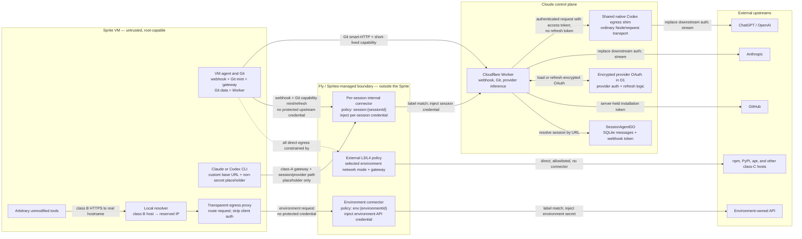
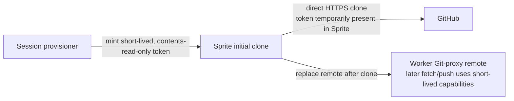
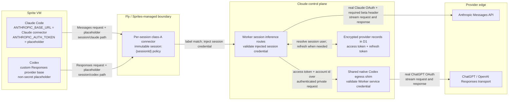
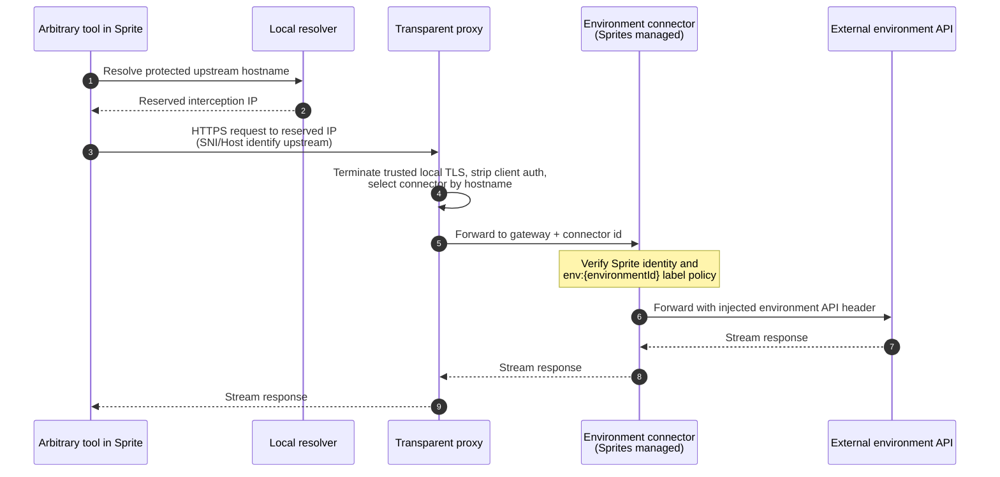

## Context

This designs the **Sprite secrets proxy** as one coherent system. It is a large,
multi-pronged change; the architecture below is whole, and the "Staging" section
sequences the _build_ without splitting the _concept_. Nothing here is meant to be
redesigned later — the abstractions (connector taxonomy, routing table, D1 schema,
data/control planes) are chosen so every prong composes.

### The three prongs (all in scope)

1. **Caller-identity binding.** Every protected credential is authorized by the
   _verified identity of the calling Sprite_, not by possession of a bearer secret.
   Fly checks the connector's access policy against the calling Sprite before
   injecting the credential, so an extracted URL/secret cannot be replayed from a
   laptop, another org's Sprite, or after the session ends.
2. **Protected upstream secrets out of the sandbox.** Webhook, GitHub installation,
   provider, and environment credentials never exist inside the Sprite. Fly injects
   connector credentials downstream of the Sprite. Until Fly accepts Git
   smart-HTTP content types, the connector exchanges its identity-bound session
   credential for a five-minute opaque Git-proxy capability. That narrow,
   expiring capability is present in the Sprite process but is not an upstream
   credential. Refreshable provider OAuth remains in our
   encrypted D1 record and is injected by the control plane after the per-session
   class-A connector authenticates the Sprite. The initial clone is the explicit
   exception: it uses the existing short-lived, contents-read-only GitHub
   installation token inside the Sprite to avoid putting the bulk clone on the
   connector/proxy path.
3. **Header credentials via connectors + a transparent MITM proxy.** For the first
   version, an environment can define one header-injected credential per upstream
   hostname. A Sprite-local transparent proxy routes the Sprite's _unmodified_
   egress to the matching connector, which injects the real secret. Multiple
   credentials for one hostname and non-header authentication are out of scope.

### Threat model

The session agent runs untrusted code **with root** (passwordless `sudo`, verified).
It can read anything in the Sprite, flush iptables, kill the proxy, read the local
CA key. The design must therefore make security independent of anything the Sprite
controls:

- **Prevented in every network mode:** off-Sprite replay of webhook, GitHub,
  provider, and environment credentials (prong 1, via Fly identity checks), and
  extraction of those protected secrets (prong 2). Directly reaching a connector's
  upstream does not inject the protected credential.
- **Controlled by the user's network mode, not promised by connectors:** general
  outbound data exfiltration. `default`, `custom`, and `locked` retain their external
  L3/L4 restrictions; `open` deliberately permits arbitrary direct egress. Choosing
  `open` does not weaken connector credential custody or caller-identity binding.
- **Not prevented (accepted, and true of any design):** a _live_ compromised Sprite
  using the connectors it is legitimately authorized for (e.g. spending the user's
  own OpenAI budget during the session); and runtimes that bypass the local CA.
  In restricted network modes a bypassed route is also blocked if the real
  destination is not allowlisted; in `open` mode it can make an uncredentialed
  direct request.
- **Explicitly accepted for initial clone:** the root-capable Sprite can observe and
  replay the short-lived contents-read-only installation token while it remains
  valid. That token cannot push, and the Sprite receives the same repository
  contents through the clone. The initial clone is not proxied because the extra hop would add
  material latency to the largest git transfer.
- **Interim Git capability exception:** until Fly accepts Git smart-HTTP content
  types, root can extract and replay a Git-proxy capability for at most five
  minutes. It cannot reveal the GitHub token, cannot mint another capability
  off-Sprite, and is revoked from DO SQLite at teardown.

### What already exists (build on it, don't reinvent)

- `network-policy.ts` — `buildFinalNetworkPolicy` with a `locked` mode (Worker +
  provider + `deny-all`). The Sprites network policy is enforced outside the VM at
  **L3/L4** (verified: IP-direct `connect()` to non-allowlisted hosts is refused).
- `GitProxyService` — legacy Sprites call `WORKER_URL/git-proxy/:sessionId/...`
  with a per-session `gitProxySecret`. New sessions use a connector-authenticated
  mint endpoint and present a five-minute capability through Git's credential
  helper; the Worker mints the GitHub installation token and injects it only when
  forwarding to GitHub. Push branch validation
  (`cloude/*` + session suffix + branch lock) and repo allowlist are enforced.
- `session-provision.service.ts` — `cloneRepo`, git remote setup, and a
  `plainEnvVars` path (the very name implies the missing _secret_ env path this
  change provides).

The remaining gap is provider proxying and environment-owned header credentials;
legacy sessions retain their original Sprite-held webhook and Git bearers.

## The unified model

Classify every outbound flow, and route each class exactly one way:

| Class                             | Examples                             | Path                                                                                                            |
| --------------------------------- | ------------------------------------ | --------------------------------------------------------------------------------------------------------------- |
| A. Credential → our control plane | webhook, Git mint, Claude/Codex inference | Sprite → **internal per-session connector** → Worker; Worker injects or delegates the final upstream credential |
| B. Credential → external upstream | environment header secret            | Sprite → transparent proxy → **environment connector** → upstream (injects the real secret, Sprites-custodied)  |
| C. Direct egress allowed by environment | npm, pypi, github raw, user allowlist | **direct** according to `open`/`default`/`custom`/`locked` (no connector credential)                         |
| D. Direct egress denied by environment  | hosts outside a restricted mode's rules | **denied** by that mode's external network policy; this class is empty under `open`                          |

A connector is the single primitive for A and B: **Fly verifies Sprite identity →
injects a connector credential → forwards.** Provider inference is class A because
it enters our control plane under the same session identity as webhook and Git minting.
Every class-A client is explicitly configurable — the vm-agent's webhook base, the
Git capability mint, and the provider CLIs' custom base URLs are all written by
our provisioning code — so **class A points directly at the connector gateway and
never enters the transparent proxy**. The proxy solves exactly one problem:
class-B upstreams are called by _unmodified, arbitrary_ tools that address the
real hostname and cannot be reconfigured (prong 3). The network policy
independently enforces the environment's chosen C/D boundary; it is not part of
connector authorization.

### System topology and trust boundaries

The connector boxes below represent the **Fly/Sprites-managed connector service**.
They are not processes inside the Sprite and they are not part of our Worker. Fly
owns the identity check, label-policy enforcement, and final header injection. The
exact connector runtime placement inside Fly's network is platform-managed and
opaque to us.



There are three distinct credential hops:

1. The Sprite sends no protected credential (or a literal placeholder).
2. The connector authenticates the Sprite from platform identity and labels, then
   injects a narrowly scoped credential on the connector-to-control-plane or
   connector-to-upstream hop.
3. For provider inference and Git, the control plane exchanges that internal
   identity for the real upstream credential. The real OAuth or GitHub installation
   token exists only on the final control-plane-to-provider hop.

## Connector taxonomy

Two kinds of connector, differing in lifetime, what they inject, and who custodies
the secret:

### Internal connector (class A) — per session

- **Lifetime:** one per session, minted at provisioning, deleted at teardown.
- **Base URL:** our Worker (`WORKER_URL`), path-routed so one connector serves
  existing `/internal/session/:sessionId/{chunks|events}` and
  `/internal/session/:sessionId/capabilities/git`, plus
  `/internal/session/:sessionId/inference/{claude|codex}/...` (the gateway forwards
  `base + <path after conn id>`). Every class-A client is configured **directly**:
  provider CLIs point their supported custom base URL at the inference prefix, the
  vm-agent's webhook base is the gateway URL, and the Git helper calls the
  capability-mint path. The Git data remote points directly at the Worker.
  Class A never enters the transparent proxy — direct config means real TLS to the
  gateway, no dependency on the local CA, resolver, or proxy process for our own
  hottest paths (webhook output streaming and Git capability minting).
- **Injected secret:** the existing **per-session control-plane token**, generated and
  stored by the session Durable Object in its SQLite. The Worker route resolves the
  Durable Object from the existing `:sessionId` path, and that Durable Object
  validates the gateway-injected token. There is no generic `/webhook` route or D1
  secret-to-session lookup. The implementation may retain the current
  `webhook_token` storage name initially, but its authority is explicitly broadened
  to the session's allowlisted webhook, Git capability-mint, and inference routes.
- **Scope:** a **per-session label** (e.g. `session:<sessionId>`) set on the Sprite
  before the connector is minted; the connector policy is
  `sprite_labels: [session:<sessionId>]`. The API
  has no Sprite-id scoping field (only `sprite_labels` / `name_prefix`), and in-VM
  root cannot change Fly labels, so a unique per-session label uniquely and immutably
  binds this connector to this one Sprite.
- **Paths:** endpoint allowlisting is mandatory for class A. Its base URL is the
  shared Cloude Worker, and the injected session token is valid only on the exact
  webhook, Git capability-mint, provider-inference, and health paths for that session. An
  off-allowlist Worker path MUST be rejected by the gateway before token injection.

### Environment connectors (class B) — per environment and hostname

- **Lifetime:** one per environment and upstream hostname, long-lived, minted when
  the environment credential is defined and reused by all sessions in that
  environment. It is revoked when that credential or environment is deleted. An
  environment has at most one class-B connector for a hostname in the first
  version.
- **Base URL:** the real upstream host (e.g. `api.openai.com`).
- **Injected secret:** the **real credential**, custodied by **Sprites** (we pass it
  once at connector creation and never store plaintext).
- **Auth shape:** one configurable header name and prefix (for example,
  `Authorization: Bearer`) per hostname. Query, cookie, signing, refresh, and
  multiple-credential selection are out of scope.
- **Scope:** `sprite_labels: [env:<environmentId>]`, set once at mint. Every session
  Sprite created for that environment carries the environment label.
- **Paths:** endpoint allowlisting is optional. An environment credential may
  intentionally authorize the entire configured upstream origin; users may add
  narrower path restrictions when the credential or API warrants them.

### Class-B create, replace, and delete

`environment_connectors` stores the environment id, upstream origin, header
configuration, gateway connection id, immutable environment label, status, and
timestamps. It never stores the credential value.

- **Create:** mint with `allow_all: false` and the immutable
  `env:<environmentId>` policy, verify the read-back, then insert the active D1
  row. If persistence fails, delete the newly minted connector. Sessions resolve
  only verified `active` rows.
- **Delete:** atomically remove the row from active lookup and mark it
  `pending_revocation`, then delete the stored gateway connection id. Delete the D1
  row only after external deletion is confirmed. Reconciliation retries any partial
  failure; deletion of a connector immediately makes stale routes in existing
  Sprites fail closed.
- **Edit or rotate:** because Sprites custodies the value and no secret-update
  primitive is assumed, create and verify a replacement connector, atomically swap
  the active D1 id, refresh active sessions' non-secret routing entry where possible,
  and revoke the old id. Before the D1 swap, failure leaves the old connector active
  and cleans up the replacement. After the swap, the new connector is authoritative;
  any active Sprite that still has the old id fails closed after revocation until
  its routing table is refreshed or its agent process is restarted. V1 chooses this
  bounded interruption over retaining an old credential after rotation.
- **Environment delete:** execute the same deletion flow for every connector owned
  by that environment. The operation is complete only when all are externally
  revoked; partial failures remain visible and reconcilable.

## Independent authorization lifecycles

Repository, session, and environment authority are separate:

- **Repository access blocked** (the user loses access, the repository is removed
  from the GitHub App installation, or the installation is suspended/deleted):
  preserve the existing behavior—reject new turns and every subsequent Git/PR
  operation, cancel the active turn, and terminate the tracked agent process.
  Preserve the Sprite, `session:`/`env:` labels, internal connector, session token,
  and class-B connectors so access can recover without destroying the existing
  checkout. The gateway-injected session token authenticates the calling session;
  it does not replace the Git proxy's existing per-request repository authorization
  check.
- **Environment or environment credential deleted:** revoke the affected class-B
  connector independently of repository and session state. Stop new sessions from
  resolving it, remove its usable external access (confirmed connector deletion or
  a verified deny-all policy), then remove its metadata. If external teardown
  cannot be confirmed, retain a non-active/pending-revocation record, retry through
  reconciliation, and do not report revocation as complete.
- **Provider credential revoked:** the provider route's live D1
  refresh/authorization check rejects it; no Sprite label or connector policy
  changes.
- **Session deleted:** delete the per-session connector and token, data plane, and
  Sprite. Leave unrelated/shared class-B connectors unchanged.

Repository access loss does not revoke user-owned environment configuration. If a
future environment is owned by an organization rather than the user, that ownership
and revocation authority must be modeled explicitly instead of inferred from
GitHub repository membership.

## Scoping class-B connectors to the right Sprites

**Decided: immutable environment-label scoping. No per-session connector policy
updates or teardown de-scoping.** This is forced and made safe by two facts:

- The connector access policy has **no Sprite-id field** — scoping is only
  `sprite_labels` (ANDed) or `name_prefix` (confirmed against the API docs). So
  "enumerate allowed Sprite ids" is not even expressible; label/prefix is the only
  way to scope.
- **In-VM root cannot change its own Sprite's Fly labels** (verified 2026-07-26 on
  disposable `hostile-root-test-7f3a9c`). With no control-plane credential injected,
  CLI label update reported no configured organization, direct management `PUT` and
  `PATCH` returned 401, the internal Sprite API exposed no label mutation path, and
  child-Sprite creation returned 401. External read-back kept
  `security-test:baseline-7f3a9c`. Labels are platform metadata controlled by the
  Sprites API, so a compromised Sprite cannot add another environment's label.

Mechanism:

- Each environment gets a stable label, e.g. `env:<environmentId>`. Every class-B
  connector owned by that environment is minted **once** with policy
  `sprite_labels: [env:<environmentId>]`.
- The server determines the session's environment before creating the Sprite and
  creates it with both `session:<sessionId>` and `env:<environmentId>` labels.
  Sprites also supports API-managed label updates after creation, but that is a
  recovery/fallback operation and must finish before connector use or agent start.
- Class-A connector creation happens **after** the labelled Sprite exists. The new
  connector is created with `allow_all: false`, the `session:<sessionId>` label,
  and its endpoint restrictions; that final policy is verified before the
  connector is made available to the Sprite.

Because the connector policy is set once and never touched per session, there is **no
per-session policy churn and therefore no concurrency race** between concurrent
sessions sharing an environment connector. The REST policy update is a
**whole-object replacement**, not an incremental add/remove, which is exactly why it
is never used to link or unlink sessions. Rotation replaces the environment
connector through an explicit control-plane operation rather than mutating its
session membership.

## Data plane: the transparent proxy (with every complication)

**Class B only.** Webhook, Git capability mint/refresh, and provider traffic are
explicitly configured to the gateway; Git smart-HTTP data is configured directly
to the Worker. None touches this data plane, so the proxy, CA, resolver, and redirect rules are
provisioned only when the session's environment defines at least one header
credential. Sessions without class-B credentials get no MITM data plane at all.
All components non-secret. Generalizes the proven `sprite-egress-proxy.mjs` from a
single hardcoded target to a routing table.

1. **Targeted redirect (iptables/nft).** The local resolver returns a reserved dummy
   destination for class-B hostnames (which unmodified tools address by real name
   and cannot be reconfigured). OUTPUT NAT redirects only
   `tcp dport 443` whose destination is that dummy address to the local proxy. It
   does **not** redirect every HTTPS connection: class-C traffic resolves to real
   addresses and bypasses the proxy, while the proxy's gateway calls also use real
   addresses and cannot loop back into the redirect. Install the toolchain at
   provisioning via `sudo apt-get install -y nftables iptables` (verified:
   passwordless sudo, `cap_net_admin`+`cap_sys_admin`). Fail closed if rules cannot
   be applied.
2. **Local CA + trust.** Per-Sprite CA; per-host SNI leaf certs. Install into the
   system store (`update-ca-certificates`) and per-runtime stores
   (`NODE_EXTRA_CA_CERTS`, `REQUESTS_CA_BUNDLE`, `SSL_CERT_FILE`, ...). Rotate/expire
   with the session. **Complication — trust-store gaps:** statically linked / Go-root
   / cert-pinned runtimes reject the MITM; enumerate and handle, document unsupported
   cases. In restricted modes the network policy may also deny their real
   destination; in `open` they may make a direct request, but receive no connector
   credential. Pre-trust the MITM is correctly rejected (fail-closed).
3. **Local resolver.** Under a gateway-only policy the platform **refuses DNS** for
   non-allowlisted hosts (verified), so an unmodified client cannot resolve a
   protected upstream to open the connection the proxy should catch. Run a local
   resolver (`127.0.0.1`) that answers **class-B** hostnames with a reserved dummy
   IPv4 address, suppresses their AAAA answers in v1, and resolves class-C hosts
   normally. The redirect matches only the dummy destination. If the proxy or DNS
   path is bypassed, restricted modes apply their normal external L3/L4 rules;
   `open` permits a direct request without the connector credential.
4. **Rewrite + route.** The proxy reads the request (SNI = intended host), strips the
   client credential header, and consults the **routing table**: one host → one
   class-B connector gateway URL or block. Class A never enters the proxy (all
   class-A clients are configured directly to the gateway); class-C never enters
   the proxy. It rewrites intercepted class-B traffic to
   `<gateway>/<connId>/<path>?<query>`. Fly injects the real secret and forwards.
   **Fail-closed default:** unrouted → block, never forward with a secret.
5. **Protocol contract (v1).** Advertise HTTP/1.1 ALPN, stream request/response
   bodies, and support required HTTP/1.1 WebSocket upgrades. HTTP/2-only clients,
   gRPC, HTTP/3, alternate ports, non-header auth, and multiple credentials for one
   hostname are explicitly unsupported.
6. **Gateway path.** The proxy resolves `api.sprites.dev` normally. Because its
   destination is not the dummy address, its calls cannot be redirected back into
   the proxy. The final network policy explicitly permits the gateway.
7. **Lifecycle.** Start before the agent runs; tear down proxy, rules, CA, resolver,
   the internal connector, and the Durable Object webhook token at session end.

## Control plane: preserve the selected network egress policy

`POST /v1/sprites/{name}/policy/network`, enforced outside the VM at L3/L4 (verified;
in-VM root cannot lift it). The connector change adds the gateway to the existing
environment policy without changing the user's selected `open`, `default`, `custom`,
or `locked` semantics:

- `open` remains allow-all.
- `default` retains its default allowlist and terminal deny.
- `custom` retains its explicit allowlist, its `includeDefaultAllowlist` choice, and
  terminal deny.
- `locked` retains only the minimum Cloude/provider destinations and terminal deny.

- In restricted modes, class-A/B credential hosts SHOULD remain out of direct
  allowlists unless the selected existing policy or an explicit user rule allows
  them. This does **not** protect the credential: a root agent that flushes the
  redirect and reaches the host directly arrives without one, because injection
  happens at the gateway after a label check that in-VM root cannot influence.
  Credential protection is the label check, never the egress policy. Keeping a host
  out of a restricted direct allowlist buys:
  - **Smaller exfiltration surface.** Every allowlisted host is somewhere data can
    go. Keeping credential hosts off the allowlist keeps the egress set minimal,
    which is what the policy is actually for.
  - **Fail-closed routing.** A bypassed proxy or resolver produces a connection
    failure instead of a silent uncredentialed request that looks like an ordinary
    upstream 401, so a broken redirect is observable.
  Under `open`, or when the user explicitly direct-allows the same host, these two
  properties do not hold. That is an intentional network-policy choice and does not
  expose the connector credential.
- Reuse `buildFinalNetworkPolicy` as the source of truth, add the connector gateway
  to modes with an allowlist, and leave `open` unchanged. Provisioning may need a
  temporary apt-mirror exception for toolchain install; the selected final policy
  is applied before the agent starts.

## Connector provisioning (`mintConnector`)

Fly exposed `POST /v1/oauth/connections/custom_api` and confirmed the request shape
through support. The endpoint was verified live on 2026-07-26: it returned `201`
with the authoritative gateway connection id and persisted the supplied label and
endpoint policy. A labelled disposable Sprite then received the injected credential
through `/headers`, while an off-allowlist `/get` request returned `403`.
One primitive:

```text
mintConnector({ baseApiUrl, token, headerName='Authorization',
                headerPrefix='Bearer', testUrl, scope, allowedEndpoints? })
  -> { gatewayConnectionId }
```

- **Create with final policy (REST)** — give every attempt a unique generated name
  and POST the credential with `allow_all: false`, the immutable Sprite labels, and
  endpoint restrictions. The response's `connection.id` is authoritative for
  gateway use, verification, and deletion. `allowed_endpoints` is mandatory for
  class-A Worker connectors and optional for class-B external-origin connectors.
- **Verify (REST)** — GET the returned id and confirm `custom_api`, the unique name,
  `allow_all: false`, labels, and endpoint restrictions before returning it.
- **Fail closed** — on any verification failure, REST-delete the connector. If a
  retryable create loses its response, reconcile only by the per-attempt unique name
  and delete a match; otherwise return `orphan_reconciliation_required`. If cleanup
  fails, retain the gateway connection id and cleanup cause in the structured error
  so the caller can reconcile the orphan. The live
  `GET /v1/oauth/connections` envelope contained only the complete `connections`
  collection, with no cursor or pagination metadata (verified 2026-07-26).
- **Host:** the API-server shared connector integration. The API server already
  holds `SPRITES_API_KEY` for Sprite lifecycle operations, so a second Worker,
  bearer, and service binding add deployment and network boundaries without
  reducing credential authority. `@repo/sprites-client` remains the only owner of
  the Sprites REST wire contract.

Who mints what: the **internal connector** is minted after its labelled Sprite is
created and deleted with the session. **Class-B connectors** are minted once per
environment and hostname when the environment credential is defined. Their
environment-label policy is never edited on session create or teardown.

## Session provisioning (synchronous, fail-closed)

The connector URLs _are_ the Sprite's egress paths, so provisioning is synchronous;
any failure fails the session closed (no Sprite ever runs with a secret in the
clear, a partially configured protected route, or an unusable callback path).
`open` network mode remains intentionally open; fail-closed here refers to connector
credential handling and routing, not to silently changing the user's network mode.
Ordered:

1. Resolve the session environment and its class-B connector metadata before Sprite
   creation.
2. Create the Sprite with `session:<sessionId>` and `env:<environmentId>` labels;
   apply a **bootstrap** network policy that allows the gateway + apt mirror (for
   toolchain install) + class-C allowlist.
3. Obtain the existing per-session control-plane token from the Durable Object;
   **mint the internal connector** (base = Worker, token = session token, policy =
   `session:<sessionId>`); verify the policy and store connector metadata in D1.
   The token remains in Durable Object SQLite and is never handed to the Sprite.
4. Configure every class-A client **directly** against the session connector
   gateway: the vm-agent's webhook base, the Git capability mint, and compatible
   provider CLIs (inference path + non-secret local placeholder). Then, **only if
   the environment defines header credentials**, install the class-B data plane:
   toolchain, local CA + trust, local resolver, transparent proxy + **routing
   table** (each environment credential host → its immutable class-B connector;
   else block), dummy-destination redirect rules, and HTTP/1.1 protocol handling.
5. Apply the environment's **final selected** network policy with connector-gateway
   reachability (`open`, `default`, `custom`, or `locked`).
6. Hand the Sprite only non-secret config (its connector gateway base + routing);
   start the agent.
7. Teardown: delete the internal connector and Durable Object session token; tear
   down the data plane and Sprite. Do not edit any class-B connector policy.

## Cutovers

Webhook must stop accepting a Sprite-held bearer and require the
gateway-injected credential. Git capability mint/refresh has the same
identity-bound requirement, but Git smart-HTTP data calls the raw Worker URL with
the five-minute capability. A stolen unexpired capability is replayable
off-Sprite until expiry or immediate DO revocation; the connector prevents
off-Sprite mint/refresh, not replay during the TTL.

- **Webhook (priority):** preserve the existing
  `/internal/session/:sessionId/chunks` and
  `/internal/session/:sessionId/events` routes. The VM receives a connector gateway
  base instead of `DO_WEBHOOK_TOKEN`; the connector injects the existing token, the
  route resolves the Durable Object from `:sessionId`, and that Durable Object
  validates the token from its SQLite. There is no generic `/webhook` route and no
  D1 token-to-session lookup.
- **Git:** preserve Worker-custodied installation token, branch validation + lock,
  repo allowlist, and `locked` policy. The connector authenticates only the
  capability mint/refresh; fetch and push go directly to the Worker using that
  short-lived capability. Keep the initial clone on direct GitHub with its
  short-lived contents-read-only token as the explicit latency exception.

## Data model (D1)

- `session_connectors` — internal connectors: `session_id`, gateway connection id,
  policy summary, status, timestamps. The webhook token remains
  in Durable Object SQLite, not D1.
- `environment_connectors` — class-B metadata (NOT plaintext; Sprites custodies the
  value): `id`, `environment_id`, name, upstream hostname, header name/prefix,
  connector gateway id, environment label (`env:<environmentId>`),
  status, and timestamps. Unique on `(environment_id, upstream_hostname)` for v1.
  The status model includes provisioning, active, replacement-pending,
  pending-revocation, and error so external connector operations can be reconciled
  without losing the only deletion id.

Provider inference adds no connector table. It reuses `session_connectors`; provider
OAuth remains in the existing encrypted provider credential record and is never
copied into connector metadata.

## Data flows

### Webhook callback (class A)

The URL path remains the source of session identity. The connector does not need a
generic webhook lookup: the Worker uses `:sessionId` to address the Durable Object,
and that Durable Object validates its own SQLite-stored token. The vm-agent's
webhook base is configured directly to the gateway URL — no resolver or proxy hop
on the output-streaming path.

```mermaid
sequenceDiagram
  autonumber
  participant Agent as VM agent in Sprite
  participant Connector as Per-session connector<br/>(Sprites managed)
  participant Worker as API Worker route
  participant DO as SessionAgentDO

  Agent->>Connector: POST gateway/{connId}/internal/session/:id/chunks or /events<br/>(direct TLS to gateway; no webhook secret)
  Note over Connector: Fly verifies Sprite identity and<br/>session:{id} label policy
  alt Label policy matches
    Connector->>Worker: Forward request with injected DO webhook token
    Worker->>DO: Resolve Durable Object from :sessionId and forward
    DO->>DO: Compare injected token with token in DO SQLite
    alt Token valid
      DO->>DO: Persist chunks or events
      DO-->>Worker: Success
      Worker-->>Connector: Success
      Connector-->>Agent: Success
    else Token invalid
      DO-->>Worker: Reject
      Worker-->>Connector: Reject
      Connector-->>Agent: Request fails closed
    end
  else Label policy mismatch
    Connector-->>Agent: Reject before forwarding
  end
```

Credential ownership is deliberately split: the Durable Object owns and validates
the webhook token; the connector custodies the forwarding copy; the Sprite has
neither. Connector creation is the only control-plane operation that transfers the
token from the session provisioning path to Sprites.

### Git fetch and push after initial clone (interim class-A control plane)

Webhook and Git capability minting share the per-session connector because they
share the same Worker base and session trust boundary. The GitHub installation
token is a **different** credential from both the gateway-injected session token
and the short-lived capability. The post-clone remote points directly at the
Worker Git proxy. A repo-local exact-URL credential helper calls the connector's
JSON mint endpoint and supplies the resulting five-minute capability to Git.

```mermaid
sequenceDiagram
  autonumber
  participant Git as Git client in Sprite<br/>remote = Worker URL
  participant Connector as Per-session connector<br/>(Sprites managed)
  participant Mint as Worker capability mint
  participant GitProxy as Worker Git proxy
  participant GitHub as GitHub

  Git->>Connector: helper POST capability mint<br/>Accept: application/json
  Note over Connector: Verify Sprite identity and<br/>session:{id} label policy
  Connector->>Mint: Inject per-session credential
  Mint->>Mint: DO validates token; store/reuse<br/>five-minute capability in SQLite
  Mint-->>Git: capability
  Git->>GitProxy: Git smart HTTP + Basic capability
  GitProxy->>GitProxy: Validate capability, repository, branch policy,<br/>session suffix, and branch lock
  GitProxy->>GitHub: Git smart-HTTP request with<br/>server-custodied installation token
  GitHub-->>GitProxy: Stream packfile response
  GitProxy-->>Git: Stream response without connector
```

**Blocker — the gateway's `Accept` allowlist rejects git (verified
2026-07-28, `test:live:gateway-accept`).** The gateway forwards a request only
when its `Accept` header contains the literal `application/json` or the
wildcard token, or is absent; everything else returns `406` before reaching
the upstream. A `text/*` wildcard does not match `text/event-stream`, so it is
a literal token allowlist rather than content negotiation. Git hardcodes
`application/x-git-*` types and the gateway does not merge multiple `Accept`
headers, so Git data cannot traverse the connector. New sessions authenticate
the small JSON capability mint through it, while legacy sessions retain their
existing bearer path. Webhooks are unaffected because the vm-agent sends no
`Accept`. This constrains S4: verify the provider CLIs' `Accept` headers before
routing inference through the gateway.

**Exit plan — return Git data to the connector.** The capability path is an
interim compatibility mechanism, not the target architecture. After Fly ships a
fix, rerun `test:live:gateway-accept` and require Git's
`application/x-git-*` requests to reach the Worker through the gateway. A support
confirmation alone is not sufficient. Once verified, new session connectors add
`/git-proxy/:sessionId/*` to their endpoint allowlist, both post-clone remotes
point to the gateway URL, and the Worker authenticates those sessions only with
the connector-injected session token. New sessions stop installing the credential
helper and stop minting capabilities. Existing capability-mode sessions remain
supported until migrated or drained, after which the mint endpoint, helper, and
capability state can be removed.

**Future optimization — move the git data plane out of the Durable Object
(recorded 2026-07-27).** As implemented, the git-proxy route hands the raw
request to the session DO, so the entire packfile stream flows through the DO —
the same single-threaded instance that handles the session's webhook chunks and
WebSocket broadcasting. The DO is only genuinely needed for three small things:
validating the short-lived capability (DO SQLite), reading the repo
allowlist and branch lock, and recording `pushedBranch` after a successful push.
The target shape is validate-then-stream: the Worker makes one internal RPC to
the DO (validate token, return repo policy + branch lock), streams the GitHub
exchange entirely Worker-side with the D1-cached installation token, and reports
a successful push back to the DO with a second small RPC. Do this only if the
S2.3 post-clone read-latency measurement shows the DO hop matters; git
operations are infrequent and GitHub round-trips dominate today.

The initial clone is the explicit exception:



This accepts temporary private-repository read exposure to avoid routing the large
initial clone through the Worker. It does not grant push access, and the token must
be removed immediately after clone and remote replacement.

### Provider inference (class A)

Like every class-A flow, provider requests do not use the transparent proxy. Both
CLIs already support a custom base URL, so they call the session's class-A
connector directly using a provider-specific path prefix. The placeholder satisfies client-side
credential validation but is never trusted by the connector or Worker.



The one class-A connector establishes session identity before either provider path.
The Worker resolves the session's user and remains the sole owner of D1 access and
OAuth refresh. Claude's final upstream request works directly from the Worker.
Codex's final ChatGPT request is delegated to one shared, stateless native service
because the spike observed ChatGPT's edge reject otherwise-equivalent workerd
requests. The native shim is not a connector, is not per user, and receives no
refresh token. It accepts only authenticated Worker calls, rebuilds an allowlisted
request, strips inbound proxy metadata, and streams the response. See
`provider-proxying.md` for the transport evidence and remaining uncertainty.

**Constraint — validate-then-stream; the DO never carries inference bytes.**
Inference streams are long-lived, per-turn, and latency-sensitive; routing them
through the session DO would put minutes-long provider streams on the same
single-threaded event loop as the session's webhook and WebSocket hot path. The
inference routes MUST make exactly one small internal RPC to the DO per request
— validate the gateway-injected session token against DO SQLite and return the
authenticated session's user id — and then handle everything else Worker-side:
the D1 OAuth read/refresh, provider egress, and response streaming. The DO hop
is authentication only; no request or response body ever passes through the DO.
This keeps the token's single source of truth (and instant revocation) in DO
SQLite without putting the DO on the data path. If a measured need ever arises
to remove the RPC entirely, the recorded escape hatch is storing a hash of the
session token in `session_connectors` for stateless Worker-side validation — a
hash is not the credential, so D1 custody intent is preserved — but prefer the
RPC until then.

The existing refresh implementations already have a cross-session race: two Worker
instances can read the same expiring user record, refresh outside a lock/version
check, and then unconditionally upsert or mark the shared row as requiring
reauthentication. Today this can happen when multiple sessions start fresh agent
processes; process reuse does not refresh on every turn. Moving inference through
the Worker does not create the race, but it invokes the refresh check per provider
request and therefore increases exposure. The concurrency fix is tracked as a
separate AI-auth change, but it is a production prerequisite for enabling S4:
serialize refresh per user/provider or use optimistic versioning, and cover
concurrent sessions plus refresh-token rotation.

### Environment header credential (class B)

Class B differs from provider inference: the connector forwards directly to the
external API and Sprites custodies the real API key. The Cloude control plane is not
in the request data path.



Direct traffic resolves normally and follows the environment's selected network
mode. Restricted modes block hosts outside their rules; `open` permits them. Either
way, a direct request does not receive the connector credential.

## Staging (build order; each stage is a real subset, none undone later)

The whole concept ships across stages that share one data model, one connector
abstraction, and one proxy — so no stage requires redesigning another.

- **S1 — connector spine + webhook.** REST-backed `mintConnector` + internal
  per-session connector + `session_connectors` D1 + webhook cutover. Proves
  identity-bound class-A end to end.
- **S2 — post-clone git cutover.** Until Fly fixes Git content negotiation,
  authenticate a short-lived capability mint through the connector and send Git
  data directly to the Worker. New sessions reject and delete the legacy bearer.
  Initial clone remains direct with its contents-read-only installation token.
  When the live gateway probe confirms the fix, switch new-session post-clone Git
  data back to the connector, retire capability issuance for new sessions, and
  remove compatibility support after older sessions migrate or drain.
- **S3 — transparent proxy data plane.** Toolchain, CA/trust, resolver, routing
  table, dummy-destination redirect, class-C/gateway bypass. Exists solely to
  enable class B (S5); webhook, Git minting, and provider CLIs stay on direct
  gateway configuration and never migrate onto the proxy.
- **S4 — provider inference through the control plane.** Claude is verified at the
  CLI/control-plane boundary: Claude Code 2.1.207 completed interactive and
  non-interactive inference using `ANTHROPIC_BASE_URL` and
  `ANTHROPIC_AUTH_TOKEN` while a Worker refreshed/read OAuth from D1 and injected it
  upstream (`test:live:claude-oauth-control-plane-proxy`, 2026-07-23). Extend the
  per-session connector with allowlisted provider paths and point Claude directly at
  the session/Claude gateway prefix; verify connector header replacement with a
  literal placeholder. Codex 0.144.3
  also completed `gpt-5.4` inference from a fresh Sprite through an authenticated
  native HTTP proxy using a short-lived non-provider bearer
  (`test:live:codex-oauth-control-plane-proxy`, 2026-07-23). A manual follow-up also
  launched the normal interactive Codex TUI in the prepared Sprite with no
  `auth.json`; it used only the temporary gateway bearer. Codex therefore needs a
  shared native egress shim behind the Worker, strict tunnel-header stripping, OAuth
  refresh, and the final class-A connector test. See `provider-proxying.md`.
- **S5 — environment header credentials.** `environment_connectors` D1,
  definition UI/API, one connector per environment/hostname, routing-table +
  immutable environment-label wiring. General class B for the v1 auth shape.

## Risks / Open questions

- **Per-session internal mint latency** — REST mint remains on the session critical
  path; minimize, overlap with VM boot, and measure.
- **Trust-store gaps** — enumerate the runtimes the agent uses that bypass the system
  CA; document handling; rely on the network policy as backstop.
- **Codex native egress lifecycle** — base inference is confirmed through native
  reqwest, and the same OAuth/account request also succeeds through Node's ordinary
  `fetch`. Workerd requests received an edge HTML `403`; the exact WAF signal remains
  unobservable, though Worker-origin metadata and the different TLS fingerprint are
  concrete transport differences. Add a deployed Worker → authenticated native shim
  → ChatGPT test, live D1 refresh/revocation in the Worker, `/models` if required,
  tools, compaction, capacity, and deployment tests before rollout.
- **Provider refresh concurrency (pre-existing)** — current Claude and Codex
  refreshes are read/refresh/upsert without serialization or optimistic versioning.
  Fix and test this in the AI-auth area before enabling the higher-frequency S4
  inference proxy; it is not part of connector provisioning.
- **Custom-header REST shape** — the verified REST request uses ordinary header mode
  and therefore only `Authorization`. Before S5, obtain and live-test the API field
  for a custom header name and generalize the request schema. Until that passes, the
  implemented contract is `Authorization` only, not an arbitrary header name.
- **Custom connector target/SSRF boundary** — the current URL validator is an early
  syntactic guard: HTTPS, no userinfo, same-origin test URL, and rejection of common
  literal loopback/private/link-local addresses and internal suffixes. A successful
  connection test proves reachability, not safety; it does not prove protection
  against a public hostname resolving to an internal address, DNS rebinding, or
  credential-bearing redirects. Before S5 accepts user-selected origins, obtain and
  verify Sprites' target/redirect protections with disposable tests. If Sprites does
  not enforce them, add a server-side resolved-address/redirect policy and document
  the residual rebinding boundary. Redirects MUST NOT forward the injected
  credential to a different origin.
- **git read latency** — the direct Worker path for chunked pulls (short-lived
  capability, no connector data hop); measure; don't route initial clone through
  it; validate post-clone fetch performance only.

## Resolved (verified)

- Gateway forwards a verifiable Sprite identity to the upstream? **No (tested)** →
  per-session internal connector; the DO webhook token does session authentication,
  while Fly does Sprite authorization.
- Network policy enforcement: **outside the VM at L3/L4 (tested)** → in restricted
  modes, in-VM root cannot lift the selected deny rules. `open` intentionally has no
  such exfiltration guarantee.
- Sprite can install nft/iptables? **Yes** — passwordless sudo; install at
  provisioning (base image fixed).
- Custom API connector REST create? **Yes (live tested 2026-07-26)** —
  `POST /v1/oauth/connections/custom_api` accepts the credential and final access
  policy, and returns the authoritative gateway connection id.
- Create default access? **Deny-all** — scope is a grant.
- How are connectors scoped to Sprites? **Labels only** — the access policy has no
  Sprite-id field (`sprite_labels`/`name_prefix` only), and in-VM root cannot change
  Fly labels, so a label is an immutable, unforgeable binding. A Sprite receives a
  unique session label and one environment label through the Sprites API. Class-A
  connectors bind to the session label; class-B connectors bind permanently to the
  environment label. Connector policy is never edited per session.
- Current webhook auth? **Known** — the VM posts to separate `chunks` and `events`
  routes with `DO_WEBHOOK_TOKEN`; the Worker resolves the Durable Object from the
  route and the Durable Object validates its SQLite-stored token. The connector
  replaces token delivery to the VM, not route or state ownership.
- Initial clone through connector? **No** — retain the current short-lived,
  contents-read-only installation token in the Sprite for clone latency. Protect
  post-clone fetch and push with connector-minted capabilities sent directly to
  the Worker only while Fly rejects Git content types. Once the live gateway probe
  confirms Git's media types pass, route post-clone fetch and push through the
  per-session connector again and retire the interim capability path.
- Transparent redirect loop? **Avoided structurally** — only the dummy destination
  returned for class-B hosts is redirected; webhook, Git mint/refresh, and provider
  CLIs use the gateway while Git smart-HTTP uses the direct Worker URL.
  Class-C/gateway destinations are never intercepted.
- Does connector provisioning require a browser? **No** — the REST endpoint covers
  the required Custom API connector shape.
- Async provisioning? **No** — synchronous, fail-closed.
- User secrets / transparent proxy in scope? **Yes, both** — part of the coherent
  whole; sequenced in Staging, not deferred in concept.
- Claude OAuth through the control plane? **Yes at the CLI/control-plane boundary
  (live tested 2026-07-23)** — a fake OAuth file worked only for non-interactive
  execution and triggered login in bare interactive Claude, so that approach is
  rejected. Claude Code 2.1.207 instead completed interactive and non-interactive
  inference through `webhooks.bze.llc` using its documented
  `ANTHROPIC_BASE_URL` + `ANTHROPIC_AUTH_TOKEN` gateway mode. Gateway mode omitted
  `oauth-2025-04-20`, so the Worker added it while loading/refreshing the real OAuth
  credential from D1 and injecting it only on the Anthropic hop. This proves
  provider compatibility, not the final Sprites connector identity/scoping or
  placeholder-overwrite layer; see `provider-proxying.md`.
