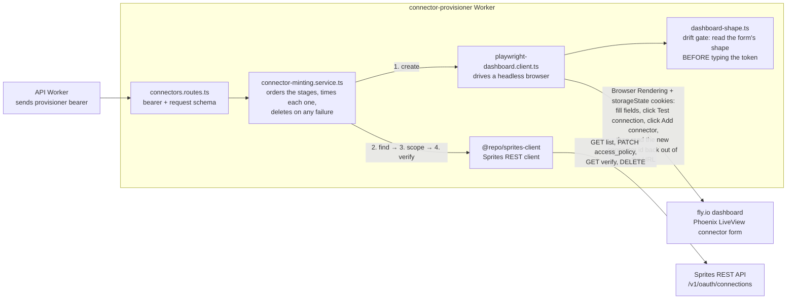

# Connector provisioner

Dedicated Cloudflare Worker that creates Sprites Custom API connectors through the
authenticated Phoenix LiveView dashboard, then discovers, scopes, and verifies them
through the supported Sprites REST API.

The browser step exists because it has to: the Sprites REST API can create
connections only for its preset providers, so a `custom_api` connector can be
born only in the dashboard form. Everything after birth — finding the gateway
id, scoping the connector to Sprite labels, verifying the scope, deleting —
is ordinary REST.



The browser is write-only as far as trust goes: the id it reads out of the
redirect URL is a convenience, and the authoritative gateway id comes from the
REST list, matched on the per-attempt unique name. A connector that cannot be
found, scoped, and verified over REST is deleted rather than returned.

The Worker keeps dashboard storage state and the Sprites API token in
provisioner-only secrets. Every operation requires a separate provisioner bearer:

- `POST /connectors/mint` creates and returns a verified connector. The
  requested `name` gets a random per-attempt suffix so attribution is
  unambiguous even across concurrent duplicate requests; the final `name` is
  returned and should be stored with the ids.
- `DELETE /connectors/:id` deletes a connector and confirms it is gone.
- `POST /connectors/live-test` mints and then deletes a disposable connector.

## Local unit tests

```bash
pnpm --filter @repo/connector-provisioner test
```

## Disposable live test

Create a Playwright storage-state file from an authenticated Sprites dashboard
session, following [Playwright's authentication guidance](https://playwright.dev/docs/auth).
Treat that file like a password and never commit it. The temporary Worker currently
receives the compact JSON through a Worker secret, so confirm it fits Cloudflare's
5 KB per-variable limit:

```bash
wc -c /secure/path/sprites-storage-state.json
export SPRITES_DASHBOARD_STORAGE_STATE="$(jq -c . /secure/path/sprites-storage-state.json)"
```

Then export `SPRITES_API_KEY`, `SPRITES_ORG_SLUG`, and the
`CONNECTOR_LIVE_TEST_*` variables shown in `.env.example` and run:

```bash
pnpm --filter @repo/connector-provisioner test:live
```

The script starts `wrangler dev --remote` with a temporary mode-0600 env file,
creates a uniquely named connector, applies the supplied Sprite label, verifies
`allow_all` is false, deletes the connector, and confirms it no longer exists.
It never prints the dashboard storage state, Sprites API token, or dummy connector
token.

The test requires Cloudflare Wrangler authentication and a Browser Run-enabled
Cloudflare account. It does not deploy the Worker or persist the supplied secrets.

If the storage state exceeds 5 KB, do not trim cookies blindly. Only at that
point move the state to KV — KV storage adds surface without reducing risk
compared to a Worker secret. If the stored state is encrypted, keep the
encryption key as a Worker secret, never in KV next to the ciphertext.
[Cloudflare's Browser Run example](https://developers.cloudflare.com/browser-run/playwright/#storage-state)
shows the KV pattern.

## Deployment boundary

For a deployed spike, set all four provisioner secrets listed in `wrangler.jsonc`
with `wrangler secret put`, then deploy this package. The public workers.dev
route is disabled (`workers_dev: false` in `wrangler.jsonc`); the Worker is
reachable only through `wrangler dev` locally or, at session integration, a
Cloudflare service binding from the API Worker. Every route additionally
requires the provisioner bearer, and `/connectors/live-test` refuses to run
when `ENVIRONMENT` is `production`.

## Credential revocation runbook

If the dashboard storage state (or the machine it was minted on) may be
compromised:

1. Revoke the Fly.io session: sign out all sessions for the dashboard user
   (or change that user's password), which invalidates the stored cookies.
2. Mint fresh storage state from a clean session and rotate it with
   `wrangler secret put SPRITES_DASHBOARD_STORAGE_STATE`.
3. Rotate `CONNECTOR_PROVISIONER_BEARER_TOKEN`. The value accepts a
   comma-separated list, so add the new token alongside the old one, move
   callers over, then remove the old token.
4. Audit the org's connectors in the Sprites dashboard and delete any
   `custom_api` connector you do not recognize.
5. Rotate `SPRITES_API_KEY` if it may have leaked with the same machine.

Operationally, treat repeated `reauthentication_required` responses as a
signal worth alerting on: an expired cookie and a revoked-because-stolen
cookie look identical from this service.
